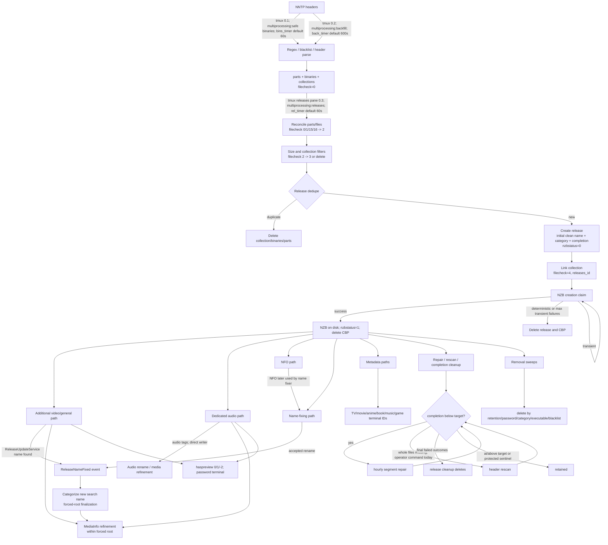

# Release lifecycle and gap audit

**Snapshot:** `codex/release-lifecycle-audit`, 2026-08-23. This document describes the code as it exists at this snapshot. It is a source audit, not an observation of production data.

## Scope and method

The map below was re-derived from the current call paths and predicates, after reviewing the first-parent history since 2026-07-20. In particular it covers the changes merged by #46, #47, #49, #56, #58, #65, #69, #72, #76, #83, #90, #92, #121, #127, #128, #132, #138, #139, #140, #141, #147, #151, #154, #156, #161, #166, #167, #168, #170, #173, #174, #176, #181, #183, #200, and #201. Source references are to this snapshot; commit/PR attribution is historical context only.

“Automatic” means reachable from the tmux engine or Laravel scheduler without an operator choosing a release or running a one-off command. `nntmux:recategorize-releases`, `predb:check`, `multiprocessing:fixrelnames predbft`, the requeue commands, and completion backfills are therefore maintenance paths, not automatic safety nets.

There is no single “fully processed” bit. A release is quiescent when every enabled consumer-specific predicate rejects it. That is the core architectural risk: the independent status fields can describe combinations no orchestrator owns.

## Stage graph



### Automatic drivers and cadence

| Stage | Driver and trigger | Current schedule / wake-up gate |
|---|---|---|
| Header ingest | `multiprocessing:safe binaries` from the Binaries pane (`app/Services/Tmux/TmuxTaskRunner.php:222-250`) | Repeated with `bins_timer`, default 60 seconds (`:247-248`), when `binaries_run=1` and kill-switch permits it. |
| Backfill headers | `multiprocessing:backfill` (`TmuxTaskRunner.php:258-295`) | Repeated with `back_timer`, default 600 seconds; progressive delay can increase it (`:282-293`). |
| Collection reconciliation, release creation, NZB creation, inline cleanup | `multiprocessing:releases` (`TmuxTaskRunner.php:303-318`) fans through `ReleasesRunner` to `ReleaseProcessingService::processReleases()` | Repeated with `rel_timer`, default 60 seconds. Each invocation performs collection processing, loops create-release/create-NZB/categorize/inline-postprocess/delete-collections, then runs release deletion (`ReleaseProcessingService.php:243-299`). |
| Standard/source name fixing | Fix Names pane (`TmuxTaskRunner.php:412-464`) | Only when `fix_names=1` **and** monitor `processrenames>0`. Runs odd methods 3..19 (plus 21 when SRRDB enabled), all `--category=other`, then `multiprocessing:fixrelnames standard`; each step is bounded by `fix_names_timeout`, followed by `fix_timer`, default 300 seconds (`:430-461`). |
| PreDB full-text matching | `multiprocessing:fixrelnames predbft` -> `releases:fix-names-group predbft` (`app/Console/Commands/ProcessFixRelNames.php:17-38`; `ReleasesFixNamesGroup.php:134-186`) | **No tmux pane or Laravel schedule invokes it in the current tree. Operator-only.** |
| Additional/general post-processing | `multiprocessing:postprocess add` in pane 2.0 (`TmuxTaskRunner.php:632-690`) | `post` setting 1 or 3, and `AdditionalCandidateQuery::backlogCounts()['available'] > 0`; `post_timer`, default 300 seconds. Buckets/workers are generated by `PostProcessRunner.php:221-275`. |
| NFO | `multiprocessing:postprocess nfo` in pane 2.0 (`TmuxTaskRunner.php:637-669`) | `post` setting 2 or 3 and monitor `processnfo>0`; same 300-second timer. `lookupnfo=1` is checked again by `PostProcessRunner.php:387-414`. |
| Audio preview/tags | `multiprocessing:postprocess aud` in metadata pane 2.2 (`TmuxTaskRunner.php:807-847`) | `post_amazon=1` and `AudioCandidateQuery` reports available work. Same `post_timer_amazon`, default 300 seconds. Fan-out uses `postthreadsaudio` (`PostProcessRunner.php:285-303`). |
| TV / anime | `multiprocessing:postprocess tv` / `ani` in pane 2.1 (`TmuxTaskRunner.php:697-749`) | `post_non=1`, per-type settings and monitor counts; `post_timer_non`, default 300 seconds. |
| Movies | `multiprocessing:postprocess mov false` in pane 2.3 (`TmuxTaskRunner.php:757-787`) | `post_non=1`, `processmovies` and monitor count; `post_timer_non`, default 300 seconds. |
| Books/music/console/games | `multiprocessing:postprocess ama` in pane 2.2 (`TmuxTaskRunner.php:807-847`) | `post_amazon=1` and any legacy metadata monitor count; `post_timer_amazon`, default 300 seconds. `PostProcessRunner.php:752-780` fans the types. |
| Segment repair | `releases:repair-completion` (`app/Console/Commands/RepairReleaseCompletion.php:27-115`) | Laravel scheduler hourly, without overlap (`routes/console.php:36-40`). Bounded by `repair_limit`. |
| Whole-missing-file rescan | `releases:rescan-missing-files` (`app/Console/Commands/RescanMissingReleaseFiles.php:33-142`) | **No scheduler/tmux caller exists. Operator-only today.** |
| Completion/deletion sweep | `ReleaseProcessingService::deleteReleases()` (`ReleaseProcessingService.php:953-969`) | Runs at the end of every Releases-pane invocation, after that invocation's create/NZB loop. Repair state is its gate; it is not itself hourly. `nntmux:remove-bad` is separately scheduled hourly (`routes/console.php:36`). |
| Executable discard | Inline while PAR2/archive file lists are examined; backlog sweep in release cleanup (`ReleaseFileManager.php:497-508`; `ReleaseProcessingService.php:1388-1399`) | Inline on AP; otherwise every Releases-pane cleanup when a root toggle is enabled. |
| Generic “remove crap” / blacklist | `releases:remove-crap` in pane 1.1 (`TmuxTaskRunner.php:518-588`) | `fix_crap_opt=All/Custom`, repeated with `crap_timer`, default 300 seconds. All mode scans the last two hours; Custom does one full first pass then four-hour windows. |
| Poster-identity blacklist | Admin creates/enables a FROM rule; `BlacklistSweepService` launches detached `releases:remove-crap --type=blacklist --time=full` (`PosterIdentityBlacklistService.php:65-105`; `BlacklistSweepService.php:129-145`) | Explicit admin action. Subsequent headers are blocked by the ordinary binary blacklist; the detached sweep handles existing releases. |

### Creation and finalization prose

Headers are grouped with a deterministic raw 20-byte SHA-1 of `cleaned collection name + declared file count`; the hash deliberately excludes group, so cross-posted copies converge (`app/Services/Binaries/CollectionHandler.php:80-93,161-205`). A collection begins at `filecheck=0`. Reconciliation counts held parts/files and promotes either genuinely complete or stale collections to `filecheck=2` (`ReleaseProcessingService.php:417-528`); sizing changes 2 to 3 (`:383-406`); size/file-count and PAR2-only filters delete before release creation (`:589-649`).

`ReleaseCreationService` admits only `filecheck=3 AND filesize>0` (`app/Services/ReleaseCreationService.php:54-63`). It applies release regex cleaning and exact PreDB matching, performs heuristic dedupe, categorizes the cleaned name, and writes the release (`:84-156`). Completion and article anchors are measured here while CBP rows still exist (`:65-78`). The collection is then linked and stamped `filecheck=4` (`:161-169`).

NZB creation independently claims `nzbstatus=0` rows. It validates nonempty collections/binaries/parts before streaming (`app/Services/Nzb/NzbService.php:100-143`), atomically moves the NZB, writes only `nzbstatus=1` plus claim resets (`:257-275,802-816`), and deletes CBP (`:288-299`). Completion is intentionally **not** recomputed at NZB creation; #156 supersedes the #147 writer (`:802-807`). Deterministic failures and exhausted transient retries delete the release/CBP (`ReleaseProcessingService.php:675-769`).

The initial category is already final with respect to forced group roots. Categorization unwraps NZBSPLIT, extracts an obfuscated subject, runs all prioritized pipes, then applies the group's forced root after the pipeline (`app/Services/Categorization/CategorizationPipeline.php:78-125`). The finalizer preserves misc locks and Other/Hashed; otherwise it maps an organic cross-root result to the forced root's “Other” leaf (`:143-171`). Therefore creation, a central name fix, and the manual recategorizer all see the same forced-root rule.

The current pipe order is Misc, group-obfuscated routing, group name, XXX, TV, Movie, Book, Music, PC, Console, then the misc safety net (`CategorizationPipeline.php:223-237`). #132's precedence is explicit rather than incidental: Movie runs before Music, and Music suppresses album/video/MP3 matches when an existing Movie result has at least 0.8 confidence (`app/Services/Categorization/Pipes/MoviePipe.php:14-38`; `MusicPipe.php:15-57`). #76's year-only fallback requires a two-or-more-word title before the year and assigns only 0.5 confidence (`app/Services/Categorization/Categorizers/MovieCategorizer.php:104-130`). #65/#138's shared adult rules make `cuckold`, `deepthroat`, or delimiter-bounded `cum` unconditional XXX signals, while weak adult words need a video marker and are suppressed by TV season structure (`app/Services/Categorization/ReleaseContext.php:16-32,95-129`; `XxxCategorizer.php:44-55,123-149`). #69/#72's group obfuscation override applies only to a Misc result whose match reason starts `obfuscated_` or `gibberish_`, and routes it to the configured root's Other leaf (`app/Services/Categorization/Pipes/GroupObfuscatedRoutingPipe.php:21-69`).

After `nzbstatus=1`, enrichment branches are asynchronous. General AP and audio share the pending predicates and claim lease, then `AudioRouting` assigns exactly one routing polarity; their size and crash-guard filters are not identical. General AP can record files/PAR hashes/NFO/media, rename from NZBSPLIT/RAR/PAR2 evidence, discard executables, and settle preview/password fields. Audio probes article 1, hands video/non-audio back with `aud:declined`, otherwise records tags/media and an optional preview. Name fixes performed through `ReleaseUpdateService` dispatch `ReleaseNameFixed`; the listener re-categorizes and then media-refines (`app/Services/NameFixing/ReleaseUpdateService.php:343-406`; `app/Listeners/RecategorizeReleaseAfterNameFix.php:22-70`). Direct book/audio normalization paths do not dispatch that event.

## Eligibility matrix

The following are the admission predicates that define the lifecycle. Optional group and GUID-bucket clauses are shown where they materially narrow work.

| Stage | Exact source predicate |
|---|---|
| Collection reconciliation | `filecheck = 2 OR (filecheck IN (0,1,15,16,10) AND COALESCE(last_seen_at,dateadded,added) < cutoff)`; optional group (`ReleaseProcessingService.php:417-454`). Reconciliation promotes when held files equal `totalfiles` or `totalfiles+1` and complete files cover `totalfiles`, or stale status is 0/1/10 (`:494-526`). |
| Collection sizing | `filecheck = CompleteParts(2)`; optional group (`ReleaseProcessingService.php:392-405`). |
| Release creation | `collections.filecheck = Sized(3) AND collections.filesize > 0`; optional `collections.groups_id` (`ReleaseCreationService.php:54-63`). |
| Dedupe | Size in `filesize ± release_dedupe_size_tolerance`, then `(predb_id = incoming OR searchname = incoming)`; if both absent, raw `name` equality (`app/Services/Releases/ReleaseDuplicateFinder.php:42-66`). On exact miss, normalized fallback uses the same size band and stored `searchname = normalized OR LIKE normalized+'.%' OR LIKE '"'+normalized+'%'`, capped at 25, followed by PHP normalization equality (`:92-118`). Native deterministic protection is unique `releases.collectionhash` (`ReleaseCreationService.php:121-128,232-255`). |
| Initial categorization | No release-row query: every new release calls `determineCategory(group, cleanedName, poster)` (`ReleaseCreationService.php:133-150`). Pipeline preprocessing/pipes/final forced-root predicate are `CategorizationPipeline.php:78-171`. |
| Categorization precedence / year-only Movie | Pipes are sorted by numeric priority; Movie is 25 and Music is 40. Music is suppressed by a Movie-root best result with confidence >=0.8 for `music_video`, `music_album`, `music_other`, or `mp3` matches (`CategorizationPipeline.php:49-65,223-237`; `MusicPipe.php:41-57`). Year-only Movie requires a year-pattern match and at least two title words, then yields `MOVIE_OTHER` at 0.5 (`MovieCategorizer.php:104-130`). |
| Forced-XXX trigger words | `ReleaseContext::hasHardAdultTrigger()` is `/cuckold|deepthroat|(?:^|[^a-z0-9])cum(?:$|[^a-z0-9])/i`; `XxxCategorizer::looksLikeXxx()` accepts it without a video marker (`ReleaseContext.php:19-29,95-103`; `XxxCategorizer.php:123-137`). Weak adult keywords require resolution/video context and lose to explicit TV season structure (`ReleaseContext.php:28-32,107-129`; `XxxCategorizer.php:44-55`). |
| Obfuscated group routing | Existing best match must start `obfuscated_` or `gibberish_`, `route_obfuscated_names=true`, an `obfuscated_default_root_categories_id` must exist, and the pass must not be misc-locked; target is that root's Other leaf (`GroupObfuscatedRoutingPipe.php:21-69`). |
| Legacy inline categorization | `categories_id = OTHER_MISC AND iscategorized = 0`, optional group (`ReleaseProcessingService.php:315-322`). Current inserts set `iscategorized=1`, so this is legacy/manual-reset recovery only. |
| Forced-root finalization | Force only when `forcedRootCategoryId IS NOT NULL`, not misc-locked, result is not `OTHER_HASHED`, and organic root differs; target is `Category::otherForRootCategory(root)` (`CategorizationPipeline.php:143-171`). |
| Ordinary name-source method | Always `predb_id=0 AND source EXISTS`; unless PreDB category mode, also `(isrenamed=0 OR categories_id IN (OTHER_MISC,OTHER_HASHED)) AND proc_<source>=0`; optional six-hour `adddate` window; automatic pane additionally passes Other category mode (`NameFixingQueryService.php:388-418`; `TmuxTaskRunner.php:438-449`). Source existence predicates for NFO/files/SRR/CRC/UID/hash/PAR2/XXX/media/SRRDB are literal in `NameFixingQueryService.php:60-70`. |
| PAR2 name-source special case | Its “source exists” expression is the unconditional `1 = 1`; therefore its ordinary predicate is only `predb_id=0`, rename/category/status/time clauses and **has no `nzbstatus=1` prerequisite** (`NameFixingQueryService.php:60-70,388-418`). A miss marks `proc_par2=1` (`NameFixingService.php:1218-1255`). |
| Standard name sweep | `leftguid=? AND isrenamed=0 AND predb_id=0 AND passwordstatus>=0 AND nfostatus>-1 AND ((nfostatus=1 AND proc_nfo=0) OR proc_files=0 OR proc_uid=0 OR proc_par2=0 OR proc_srr=0 OR proc_hash16k=0 OR proc_crc32=0) AND categories_id IN (OTHERS_GROUP)` (`NameFixingQueryService.php:121-147`). |
| SRRDB CRC name fixing | Ordinary source predicate plus `release_files.crc32` length 8, `proc_srrdb=0`, `is_trusted_name=0`; automatic only when SRRDB configured (`NameFixingQueryService.php:60-70,388-418`; `TmuxTaskRunner.php:438-447`). |
| PreDB full text | PreDB row: `LENGTH(title)>=15 AND title NOT REGEXP '["<> ]' AND searched=0 AND predate < now-1 day`, worker modulo partition, oldest first (`NameFixingQueryService.php:282-303`). Confirmed releases are search-backend results limited to 21, then `id IN (...) AND predb_id=0 AND (name LIKE %title% OR searchname LIKE %title%)` (`:310-329`). No category constraint. |
| PreDB file matching | `predb_id=0 AND isrenamed=0 AND categories_id IN OTHERS_GROUP AND EXISTS release_files.name`, keyed by id (`NameFixingQueryService.php:331-373`). Operator-only command. |
| Recategorize after central name fix | Event-specific release id; no category/isrenamed predicate. If category and `iscategorized=1` already agree it still runs MediaInfo refinement (`RecategorizeReleaseAfterNameFix.php:22-59`). |
| MediaInfo refinement | Current category must be one of `MOVIE_OTHER, TV_OTHER, XXX_OTHER, MUSIC_OTHER`; requires video or audio evidence, and target root must equal any group forced root (`app/Services/Categorization/MediaInfoRefinementService.php:23-70,100-134`). |
| Shared AP pending set | `passwordstatus = PasswordInspectionMode::pendingReleaseStatus() AND haspreview=-1 AND nzbstatus=1`; optional `size > min`, `size < max`, group and leftguid (`app/Services/AdditionalProcessing/ReleaseClaimant.php:56-81`). Available claims also require `additional_pp_claimed_at IS NULL OR < staleBefore` (`:94-106`). |
| General/video AP | Shared pending set with `minsizetopostprocess` (default fallback 1 MiB in source) and maximum, then `NOT routedToAudio OR additional_pp_claim_token='aud:declined'` (`app/Services/AdditionalProcessing/AdditionalCandidateQuery.php:55-78,90-114`; `app/Services/AudioProcessing/AudioRouting.php:69-75`). |
| Audio AP | Shared pending set with **no minimum**, same maximum; `routedToAudio AND (claim_token IS NULL OR claim_token != 'aud:declined') AND pp_timeout_count < maxpptimeoutcount` (`app/Services/AudioProcessing/AudioCandidateQuery.php:45-68,74-101`; `AudioRouting.php:51-59,112-121`). Audio routing is Music category 3000..3999 or group forced to Music. |
| Preview generation policy | It does not select rows. Once AP owns a row, generation is allowed unless its category belongs to a root whose `generate_previews` is false (`app/Services/Releases/PreviewGenerationPolicy.php:50-79`). A policy skip settles `haspreview=-2`; category writers can restore only `id IN (...) AND haspreview=-2 AND categories_id NOT IN disabled roots` (`:96-127`). |
| NFO | `nfostatus BETWEEN -(maxRetries+1) AND -1` plus configured size bounds; exact SQL fragment is returned by `NfoService::NfoQueryString()` (`app/Services/NfoService.php:976-990`). Archive fallback separately selects `nfostatus=-9` with recorded NFO-like release files (`:878-955`). |
| Movie metadata | `categories_id BETWEEN 2000 AND 2999 AND imdb_id_needs_lookup_sql(imdbid)`, plus `isrenamed=1` when `lookupimdb=2` or renamed-only invocation (`PostProcessRunner.php:416-452`). Worker restates the root/imdb/leftguid/renamed predicate (`app/Services/MovieService.php:1050-1076`). |
| TV metadata | `categories_id BETWEEN 5000 AND 5999 AND categories_id != 5070 AND videos_id=0 AND size>1048576 AND tv_episodes_id BETWEEN -3 AND 0`, plus renamed filters (`PostProcessRunner.php:455-499`; worker base `app/Services/TvProcessor.php:201-233`). |
| Anime metadata | `categories_id=5070 AND anidbid IS NULL` (`PostProcessRunner.php:586-617`; `app/Services/AnimeProcessor.php:85-111`). |
| Book metadata | `(categories_id BETWEEN 7000 AND 7999 OR categories_id=3030) AND book work condition`. With `lookupbooks=2`, condition is `bookinfo_id IS NULL AND isrenamed=1`; otherwise null metadata or legacy NZB wrapper names (`PostProcessRunner.php:619-670`). Worker uses null book id, same categories, optional bucket/group and optional `isrenamed=1` (`app/Services/BookService.php:394-427`). |
| Music metadata | Music MP3/lossless/other and `musicinfo_id IS NULL` at scheduler (`PostProcessRunner.php:175-185,673-696`). Worker adds leftguid/group and, when `lookupmusic=2`, `isrenamed=1` (`app/Services/MusicService.php:479-504`). |
| Console metadata | Game root..other, `consoleinfo_id IS NULL`, and `isrenamed=1` when `lookupgames=2` (`PostProcessRunner.php:190-201,698-723`; `app/Services/ConsoleService.php:495-514`). |
| PC game metadata | `categories_id=PC_GAMES AND gamesinfo_id=0`, and `isrenamed=1` when `lookupgames=2` (`PostProcessRunner.php:207-218,725-750`; `app/Services/GamesService.php:744-774`). |
| Segment repair | `nzbstatus=1 AND completion>0 AND completion<target`, then due `repair_outcome='retry-pending' AND repair_attempted_at<cutoff`, followed by never-attempted `repair_outcome IS NULL` (`app/Services/ReleaseRepair/ReleaseRepairCandidateQuery.php:34-73`). |
| Whole-file rescan | Same measured-below base; due `rescan_outcome='retry-pending'`, then never-attempted `rescan_outcome IS NULL AND (declaredfiles IS NULL OR declaredfiles>totalpart)` (`app/Services/ReleaseRepair/RescanCandidateQuery.php:37-91`). |
| Completion deletion | `completion < threshold AND completion > 0 AND repair_outcome IN (failed, skipped-floor, skipped-budget) AND (rescan_outcome IN same final values OR declaredfiles IS NULL OR declaredfiles<=0 OR declaredfiles<=totalpart)` (`app/Services/Releases/IncompleteReleaseSweepQuery.php:40-51`; final enum values `app/Enums/ReleaseRepairOutcome.php:56-74`). |
| Executable discard | Inline predicate is configured extension match **and** root `discard_executables=true` (`app/Services/Releases/ExecutableReleaseDiscardService.php:65-106`). Backlog query is `categories_id IN enabled-root leaves AND EXISTS release_files.name LIKE %.extension` (`:161-203`). |
| Poster/subject blacklist sweep | Loads enabled `binaryblacklist` blacklist rules for subject/from fields, then examines every release in the chosen adddate window and applies group-regex plus PHP regex to `searchname` or `fromname` (`app/Services/ReleaseRemoverService.php:593-644`). Poster-page action uses an exact escaped FROM regex and observed-group regex (`PosterIdentityBlacklistService.php:28-39,65-105`). |

## State-field inventory

The tables below inventory lifecycle writers and **gating** readers. Display/search projections that merely expose a value are not gates and are not repeated. Bulk maintenance commands are included when they can put a row back into a pending state. Unless noted otherwise, current inserts obtain the database default before the listed writer changes it.

### Identity, routing, and creation state

| Field | Writers and transitions | Readers that gate work; terminal meaning |
|---|---|---|
| `collections.filecheck` | Header insert starts at 0. Reconciliation uses 0/1/10/15/16 -> 2 and can mark 5 for deletion (`ReleaseProcessingService.php:494-578`); sizing uses 2 -> 3 (`:383-406`); the ingest fast path can promote in-progress statuses directly to 3 (`app/Services/Binaries/CollectionHandler.php:604-682`); release creation writes 3 -> 4 (`ReleaseCreationService.php:161-169`). The full enum, including 15 temporary-complete and 16 zero-part, is `app/Enums/CollectionFileCheckStatus.php:13-90`. | Reconciliation, sizing, filters, and release creation use the exact predicates in the matrix. `4` is terminal for collection processing and means linked to a release; `5` is terminal deletion work. No ingest guard prevents new binaries/parts being attached to a row already at 4: duplicate-hash resolution returns the existing id (`CollectionHandler.php:541,594`) and the binary/part handlers insert under that id (`BinaryHandler.php:102-165`; `PartHandler.php:68-143`). |
| `collections.collectionhash` | Written once on header insert as raw `sha1(cleanedName.totalFiles, true)` (`CollectionHandler.php:80-93,521-533,561-576`). | Unique collection identity and the lookup key for subsequent headers (`:188-220,541,594`). Carried to `releases.collectionhash` at native creation. Immutable/terminal identity. |
| `collections.declaredfiles` | Written with the subject-declared count on insert and deliberately not rewritten (`CollectionHandler.php:521-533,561-576`; migration rationale `database/migrations/2026_08_21_120000_add_declared_files_and_article_anchors.php:15-49`). | Creation-time completion denominator and copied to the release (`ReleaseCreationService.php:65-72,140-154`). Immutable; unlike `totalfiles`, it survives stale promotion. |
| `collections.filesize`, `totalfiles`, `releases_id`, `last_seen_at` | Aggregate refresh and release processing write size/last-seen (`CollectionHandler.php:604-682`; `ReleaseProcessingService.php:383-406,494-528`); stale reconciliation may replace `totalfiles` with held-file reality (`ReleaseProcessingService.php:539-578`); creation writes `releases_id` with `filecheck=4` (`ReleaseCreationService.php:161-169`). | Size/count filters and creation require positive `filesize`; completion uses declared rather than mutable total; NZB creation joins linked collections by `releases_id` (`NzbService.php:100-143`). `releases_id` plus filecheck 4 is terminal until CBP cleanup. |
| `releases.collectionhash` | Native creation copies the collection hash (`ReleaseCreationService.php:121-155`); NZB import instead writes a raw SHA-1 of the sorted unique segment message IDs (`app/Services/Nzb/NzbImportService.php:630-645,687-718`). | Unique index is deterministic dedupe within each producer's hash scheme (`ReleaseCreationService.php:232-255`; `NzbImportService.php:649-673`). It is immutable/terminal. Because the two producers intentionally use different inputs, native-vs-import matching still depends on heuristic name/size dedupe (`NzbImportService.php:696-701`). |
| `name`, `searchname`, `fromname` | Native/import creation writes all three (`ReleaseCreationService.php:84-155`; `NzbImportService.php:624-645`). Central and direct renamers replace `searchname`; `name` remains the raw creation identity (`ReleaseUpdateService.php:343-406`; `AudioTagRenamer.php:55-79`; `BookService.php:430-473`). | `name/searchname` drive categorization, exact/normalized dedupe, ordinary naming evidence, wrapper-name book work, blacklist subject sweeps, and manual searches (`ReleaseDuplicateFinder.php:42-118`; `NameFixingQueryService.php:310-418`; `PostProcessRunner.php:660-670`; `ReleaseRemoverService.php:593-644`). `fromname` gates dedupe diagnostics and poster-identity blacklist sweeps (`PosterIdentityBlacklistService.php:28-39,143-174`). `searchname` is mutable; raw `name/fromname` are normally terminal after creation. |
| `groups_id`, `releases_groups` | The first collection insert owns `collections.groups_id`; cross-post names are also accumulated in `collection_groups`. Creation copies the primary id and expands all known names to `releases_groups` (`CollectionHandler.php:198-208,400-459`; `ReleaseCreationService.php:60-64,134-179,265-297`). Import writes its chosen group (`NzbImportService.php:624-645`). | The primary `releases.groups_id` gates forced-root categorization, audio routing, group-scoped naming/metadata, repair/rescan NNTP selection, and cleanup. Those policy readers do not consult `releases_groups` (`CategorizationPipeline.php:87-110`; `AudioRouting.php:112-121`). Immutable absent a manual data change; cross-post policy is therefore first-primary-group dependent (Gap G20). |
| `guid`, `leftguid` | Creation/import writes a GUID; `Release::insertRelease()` derives `leftguid` from it, while normalization maintenance can rewrite malformed GUIDs (`ReleaseCreationService.php:145`; `NzbImportService.php:630-645`; `Release.php:238-272`; `ReleasesNormalizeGuids.php:170-259`). | `guid` locates the NZB and deletion artifacts; `leftguid` partitions tmux name/AP/metadata batches. These are routing identities, terminal after normalization. A bad/mismatched left character can hide work from bucketed workers. |
| `size`, `postdate`, `adddate` | Native creation copies collection size/date and the model sets add time; import computes size and writes dates (`ReleaseCreationService.php:137-155`; `NzbImportService.php:624-645`; `Release.php:238-272`). | `size` gates dedupe tolerance, AP maximum/general minimum, NFO bounds, TV processing, category/group limits, and cleanup. `postdate/adddate` gate ordering, retention, recent-window naming, cross-post cleanup, and retry preference (`ReleaseDuplicateFinder.php:42-118`; `ReleaseClaimant.php:56-81`; `NfoService.php:976-990`; `NameFixingQueryService.php:388-418`; `ReleaseProcessingService.php:1170-1305`). Normally terminal measurements. |
| `categories_id` | Initial category is written at native/import creation (`ReleaseCreationService.php:133-155`; `NzbImportService.php:624-645`). Central name fixes dispatch a listener that writes the recategorized value (`ReleaseUpdateService.php:343-406`; `RecategorizeReleaseAfterNameFix.php:22-70`). Inline AP and audio can media-refine it (`ReleaseFileManager.php:277-280`; `AudioReleaseProcessor.php:164-168`); `AudioTagRenamer` and `BookService` also write directly (`AudioTagRenamer.php:55-79`; `BookService.php:430-473,553-588`). Manual recategorization is another writer (`app/Console/Commands/RecategorizeReleases.php:40-116`). Every pipeline categorization ends with forced-root finalization (`CategorizationPipeline.php:143-171`). | It gates standard/source naming, audio routing, every metadata type, preview policy, executable policy, retention/category cleanup, and browse/search. Exact processing gates are in the matrix. It is **not globally terminal**: central rename, manual recategorization, and media evidence may change it. A forced group root constrains every pipeline write to that root, but media refinement can still choose a leaf within it. |
| `iscategorized` | Current creation writes 1 (`Release.php:264-271`); central fixes write 1 (`ReleaseUpdateService.php:389-393,417-426`); direct audio rename writes 1 (`AudioTagRenamer.php:68-74`). The manual `--all` command first writes 0 broadly and writes 1 back only through the changed-category path (`RecategorizeReleases.php:64-105`). | Legacy inline categorization admits only `categories_id=OTHER_MISC AND iscategorized=0` (`ReleaseProcessingService.php:315-322`); removal heuristics also require `iscategorized=1` (`ReleaseRemoverService.php:337-383`). `1` is normal quiescence, not immutable. |
| `isrenamed` | Native/import creation derives 0/1 from the cleaned-name verdict (`ReleaseCreationService.php:84-155`; `NzbImportService.php:630-645`). Accepted central fixes and SRRDB write 1 (`ReleaseUpdateService.php:343-377,414-469`). Direct book/audio paths write 1 (`BookService.php:430-473,553-564`; `AudioTagRenamer.php:68-74`). Reset/admin tools may put it back to 0. | `0` is required by standard/prefile naming and participates in ordinary source gates; renamed-only metadata gates require 1. `1` is terminal for automatic naming but opens configured metadata lookup. A 0 row outside Other is not automatically terminal in the schema, but is terminal in the current standard sweep (Gap G1a). |
| `is_trusted_name` | Creation sets it for a proper cleaned name or PreDB match (`Release.php:268-272`); central rename writes whether the selected donor is trusted (`ReleaseUpdateService.php:343-377`); SRRDB sets 1 (`:457-469`). The trusted-donor predicate is defined at `NameFixingQueryService.php:35-38`. | Gates which rows may donate names through files, UID, hash, SRR, and CRC; SRRDB candidates require 0 (`NameFixingQueryService.php:217-276,388-418`). `1` is terminal for SRRDB lookup and enables donor propagation; `0` remains eligible when other gates agree. |
| `predb_id` | Creation/import exact matching writes 0 or the match id (`ReleaseCreationService.php:102-155`; `NzbImportService.php:583-645`). Central name updates and SRRDB write it (`ReleaseUpdateService.php:343-377,457-469`). Exact `Predb::checkPre()` and `attachPredbId()` can write only this column after creation (`app/Models/Predb.php:107-148`; `ReleaseUpdateService.php:445-455`). | All automatic name-source and standard queries require 0; full-text confirmation also requires 0. Metadata does not generally require it. `>0` is terminal for name fixing and makes the name trusted at creation, but the later single-column attach does not also set `isrenamed`/trust (Gap G18). |
| `nzbstatus` | Native creation writes 0 (`ReleaseCreationService.php:137-155`); successful writer changes 0 -> 1 (`NzbService.php:266-275,802-816`); imported NZBs start at 1 (`NzbImportService.php:630-645`). Failed native creation is represented by the companion failure row and eventually release deletion, not another `nzbstatus` value (`ReleaseProcessingService.php:675-769`). | NZB creation requires 0 (`app/Services/Nzb/NzbCreationCandidateQuery.php:24-43`). AP/audio, repair/rescan, completion backfill, and several cleanup paths require 1. `1` is terminal success. |
| `nzb_creation_claimed_at`, `nzb_creation_claim_token`, companion failure state | Candidate claiming writes time/token and successful write clears both (`NzbCreationCandidateQuery.php:45-181`; `NzbService.php:266-275,807-813`). `ReleaseProcessingService` records transient attempt count/retry time/reason and clears it on success or deletion (`ReleaseProcessingService.php:675-769`; `NzbService.php:269-273`). | The candidate query admits null/stale claims and due failures; deterministic failures and exhausted attempts are deletion-terminal. Claims are leases, not terminal state. |
| `groups_id` | Native creation copies the primary collection group; import resolves/writes the NZB group (`ReleaseCreationService.php:137-155`; `NzbImportService.php:600-645`). It is otherwise stable. | Gates optional group-scoped runs, forced-root categorization/audio routing, rescan group selection, and blacklist group regexes (`CategorizationPipeline.php:78-171`; `AudioRouting.php:112-121`; `MissingFileRescanService.php:108-139`; `ReleaseRemoverService.php:593-644`). Missing group identity is final/skipped for rescan. |
| `size` | Creation/import writes the CBP/NZB total; central lifecycle does not normally recalculate it (`ReleaseCreationService.php:137-155`; `NzbImportService.php:630-645`). | It gates dedupe tolerance, AP min/max, NFO min/max, TV minimum, category-size deletion, and several metadata/removal queries (exact stage predicates above). Stable input, not a progress status. |
| `guid`, `leftguid` | Creation generates the GUID and its first character; import follows the same release insert contract (`Release.php:245-272`; `NzbImportService.php:630-645`). | `guid` addresses the stored NZB and preview/media artifacts; `leftguid` partitions name fixing, AP/audio, NFO, and metadata fan-out. They are immutable. A malformed/non-hex left character is not automatically repaired and would fall outside the expected 16 buckets (`ReleaseClaimant.php:35-41`; `PostProcessRunner.php:91-153`). |
| `name`, `searchname`, `fromname` | Creation/import writes raw/cleaned/poster identity. Central and direct rename paths rewrite `searchname`; `name` and `fromname` remain the raw provenance (`Release.php:247-272`; `ReleaseUpdateService.php:343-406`; direct writers listed under `isrenamed`). | They gate heuristic dedupe, categorization, PreDB/full-text/file matching, metadata parsing, and subject/poster blacklist rules (`ReleaseDuplicateFinder.php:36-118`; `NameFixingQueryService.php:282-373`; `ReleaseRemoverService.php:593-644`). `searchname` is mutable derived state; raw `name`/`fromname` are effectively terminal provenance. |
| `adddate`, `postdate` | Native creation writes current add time and collection post time; imports supply their parsed times (`Release.php:255-260`; `NzbImportService.php:630-645`). | `adddate` gates six-hour name-source windows and blacklist/removal windows. `postdate` supplies retention age, claim ordering, repair ordering, and the fallback rescan window (`NameFixingQueryService.php:409-412`; `ReleaseClaimant.php:129-133`; `RescanCandidateQuery.php:59-68`; `RescanWindowResolver.php:31-95`). Stable timestamps. |

### Naming, additional processing, and metadata state

| Field | Writers and transitions | Readers that gate work; terminal meaning |
|---|---|---|
| `passwordstatus` | Creation uses a **mode-dependent** pending value: -1 when deep inspection is active, otherwise 0 (`Release.php:242-263`; `PasswordInspectionMode.php:11-20`). General AP settles to archive result 0/1 or leaves the current mode's pending value when a preview rerun is owed (`ReleaseFileManager.php:320-360`); audio settles to 0 (`AudioReleaseProcessor.php:221-235`); repair/policy requeues use the mode-aware pending value (`ReleaseRepairService.php:191-202`; `PreviewGenerationPolicy.php:120-128`). Three reset paths hard-code -1 (`NntmuxResetPostProcessing.php:75-90,353-369`; `ProcessAdditionalGuid.php:72-80`). | Shared AP requires **equality** with the current `pendingReleaseStatus()` (`ReleaseClaimant.php:56-66`); standard naming merely requires `>=0` (`NameFixingQueryService.php:129-143`); password cleanup/search reads final 0/1. The pending value is not stable across configuration changes (Gap G6). Once settled, 0 means no password and 1 means passworded; cleanup policy may delete 1. |
| `haspreview` | Creation writes -1 pending (`Release.php:262-267`). General/audio AP settle to 0 no artifact, 1 artifact, or -2 skipped by root policy (`ReleaseFileManager.php:282-360`; `AudioReleaseProcessor.php:210-235`). Preview policy, repair, and requeue commands can move 0/-2 -> -1 (`PreviewGenerationPolicy.php:96-128`; `ReleaseRepairService.php:191-202`; `RequeueMissingVideoPreviews.php:44-172`; `RequeueAudioPreviews.php:180-203`). | Shared AP requires -1. Preview display/removal reads 0/1; policy restoration reads -2. Values 0, 1, and -2 are terminal for AP until an explicit/category-policy requeue; -1 is pending. |
| `jpgstatus`, `videostatus` | Default/reset 0; media extraction and AP finalization write 1 when an artifact exists (`app/Services/AdditionalProcessing/MediaExtractionService.php:184-240`; `ReleaseFileManager.php:312-318`). Reset paths write 0 (`NntmuxResetPostProcessing.php:75-90,353-369`; `ProcessAdditionalGuid.php:72-80`). | They gate the “no movie/XXX preview” removal predicate together with NFO/PreDB/haspreview (`ReleaseRemoverService.php:871-877`) and are exposed in search. 1 is terminal artifact-present until reset; 0 can be either not tried or none, so `haspreview` owns AP completion. |
| `rarinnerfilecount` | Archive inspection records the number of inner files; resets return it to 0 (`ReleaseFileManager.php:320-360`; `NntmuxResetPostProcessing.php:75-90,353-369`). | It narrows the explicit missing-video-preview backfill to bare-container cases (`RequeueMissingVideoPreviews.php:92-121,169-173`). It does not own normal AP completion; 0 can mean uninspected or no archive contents. |
| `audiostatus` | No active lifecycle writer was found; only schema/preflight/index plumbing references it (`app/Console/Commands/ReleasesOptimizePreflight.php:155-167`). | No active lifecycle gate was found. It is a dormant legacy column; audio completion is represented by `haspreview`, tag rows, and `proc_pp`. |
| `nfostatus` | Creation/reset writes -1 (`Release.php:263-266`; reset references above). NFO processing decrements failures through the retry band, writes 1 on success, 0 on definitive no-NFO, -9 after normal retry exhaustion, and -10 after archive fallback exhaustion (`app/Services/Nzb/NzbContentsService.php:81-125`; `NfoService.php:146-154,524-545,565-638,878-955,1709-1720`). | NFO candidates use a configured negative interval ending at -1; archive fallback reads -9 **only when an NFO-like nonempty `release_files` row exists** (`NfoService.php:878-990`). Standard naming requires `nfostatus>-1` even for its non-NFO sources. Removal predicates also read 0/1. Values 0, 1, and -10 are terminal for NFO; -9 is terminal when archive prerequisites are absent and otherwise has one archive attempt. All negative states, including terminal -9/-10, are terminal for the standard sweep (Gap G1b). |
| `proc_nfo`, `proc_files`, `proc_par2`, `proc_uid`, `proc_srr`, `proc_hash16k`, `proc_crc32` | Central accepted fixes set the corresponding field to 1; misses are also marked processed by the standard/source loops through `updateSingleColumn()` (`ReleaseUpdateService.php:414-443`; `NameFixingService.php:959-1145`). NZB parsing can mark `proc_par2=1` (`NzbContentsService.php:190-206,274-295`). Reset tools can return them to 0. | 0 plus source existence is pending in ordinary methods; standard uses the seven-way OR shown in the matrix. 1 is terminal for that method. The tmux monitor reads only NFO/files/PAR2, not UID/SRR/hash/CRC (Gap G2). |
| `proc_srrdb` | Default 0. SRRDB success writes 1; ambiguous/paginated results are marked 2 by the SRRDB loop (`ReleaseUpdateService.php:457-469`; `NameFixingService.php:785-899`). | SRRDB requires 0 and untrusted name (`NameFixingQueryService.php:388-418`). Both 1 processed and 2 ambiguous are terminal/no-retry. |
| `proc_pp` | Direct audio-tag rename writes 1 (`AudioTagRenamer.php:68-74`). Legacy/AP PAR2 naming reads it but central PAR2 name fixing records `proc_par2`, not `proc_pp` (`ReleaseFileManager.php:511-567`). | Audio-tag and PAR2 rename attempts require 0. 1 is terminal for these direct paths. Because few writers advance it, 0 does **not** mean AP as a whole is pending. |
| `proc_sorter` | No active lifecycle writer or gating reader was found; it survives only in schema/preflight checks (`ReleasesOptimizePreflight.php:155-167`). | Dormant legacy column. Central updater recognizes the string `sorter` as a rename type but writes no `proc_sorter` flag (`ReleaseUpdateService.php:414-427`). |
| `additional_pp_claimed_at`, `additional_pp_claim_token` | Shared claimant writes a lease timestamp/token and workers normally clear both (`ReleaseClaimant.php:118-166,239-268`). Audio decline writes `claimed_at=NULL, token='aud:declined'` (`AudioCandidateQuery.php:174-197`). General/audio settlement and timeouts clear them (`ReleaseFileManager.php:327-360,383-400`; `AudioReleaseProcessor.php:221-235`). | Both paths exclude live claims and reclaim stale ones (`ReleaseClaimant.php:94-106,285-310`). Audio accepts null/non-declined token; general accepts non-audio **or** declined (`AudioRouting.php:51-75`). `aud:declined` is intentionally durable until general AP claims it, not a completion marker. |
| `pp_timeout_count` | General AP increments only in its timeout handler and deletes on reaching the maximum (`ReleaseFileManager.php:383-406`). Audio increments **before** archive fetch and normally settles without resetting it (`AudioReleaseProcessor.php:65-67,127-139`). | Audio requires `< maxpptimeoutcount` (`AudioCandidateQuery.php:74-101`); general AP has no such predicate. At/above maximum is terminal only for audio, creating a stranded audio-routed state after a crash (Gap G5). |
| `musicinfo_id`, `bookinfo_id`, `consoleinfo_id`, `gamesinfo_id`, `movieinfo_id`/`imdbid`, `videos_id`/`tv_episodes_id`, `anidbid` | Their type services write provider IDs and negative/no-match sentinels; central name fixing clears the applicable IDs so a new name can be looked up (`ReleaseUpdateService.php:343-393`). Direct book/audio renames do not perform the same complete reset. Representative writer/query pairs are `MusicService.php:479-542`, `BookService.php:394-588`, `ConsoleService.php:495-560`, `GamesService.php:744-900`, `MovieService.php:1050-1160`, `TvProcessor.php:201-280`, and `AnimeProcessor.php:85-150`. | Exact root/category/null/renamed gates are in the eligibility matrix. Null/0 generally means pending; a positive id is linked/terminal; the type-specific negative values mean attempted/no match and are terminal until a central rename/reset. |

### Completion and recovery state

| Field | Writers and transitions | Readers that gate work; terminal meaning |
|---|---|---|
| `completion` | Native creation measures held/declared segments from CBP and writes 0..100 (`ReleaseCreationService.php:65-78,137-155`). Successful NZB creation deliberately does **not** rewrite it (`NzbService.php:802-816`). Import omits it and therefore leaves the database default 0 (`NzbImportService.php:630-645`). NZB parsing writes only when the old value is 0 (`NzbContentsService.php:311-327`); the operator-only backfill writes measured values (`BackfillReleaseCompletion.php:67-103,145-153`); repair/rescan write their post-rewrite measurements (`ReleaseRepairService.php:94-128,244-264`; `MissingFileRescanService.php:220-245,403-422`). | Repair, rescan, and deletion all require `completion>0 AND completion<target`; 0 is a protected “never measured” sentinel. Values at/above the current target are quiescent, not immutable. Outcome gates can make a below-target value quiescent. |
| `declaredfiles`, `totalpart`, `firstarticle`, `lastarticle` | Native creation copies all from the collection/CBP (`ReleaseCreationService.php:65-78,137-155`). Import writes `totalpart` but omits `declaredfiles` and article anchors (`NzbImportService.php:630-645`). Rescan lazily derives/persists declared count from the NZB (`MissingFileRescanService.php:88-105`; `app/Services/ReleaseRepair/DeclaredFileCount.php:21-67`). | `declaredfiles>totalpart` or null gates first rescan; null/<=0/<=totalpart makes the completion sweep consider rescan unnecessary; anchors choose the rescan overview window. Thus null is simultaneously “needs derivation” and “safe to delete” (Gap G8). The counts/anchors are otherwise stable. |
| `repair_attempted_at`, `repair_outcome` | Repair writes both together after a real pass; infrastructure/storage failures deliberately leave them unchanged (`ReleaseRepairService.php:40-128,205-264`). Outcomes are `retry-pending`, `repaired`, `failed`, `skipped-floor`, and `skipped-budget` (`app/Enums/ReleaseRepairOutcome.php:13-74`). | Candidate order is due retry then null; no other outcome is revisited (`ReleaseRepairCandidateQuery.php:34-73`). Sweep requires one of failed/skipped-floor/skipped-budget. `repaired` is terminal even if a later target rises (Gap G10); `retry-pending` is nonterminal after its timestamp; three failure/skip values are deletion-terminal. |
| `rescan_attempted_at`, `rescan_outcome` | Rescan writes both together; storage/fetch inability that is not a release verdict leaves state untouched. Any successful NZB rewrite writes `repaired`, even when completion remains below target (`MissingFileRescanService.php:69-245,403-422`). | Candidate order is due retry then null plus missing-file evidence; no other outcome is revisited (`RescanCandidateQuery.php:37-91`). Sweep treats failed/skipped values as deletion-final. `repaired` is always terminal, causing partial-recovery limbo (Gap G9). |

### Policy fields outside the release row

| Field | Writers and gating readers |
|---|---|
| `usenet_groups.route_obfuscated_names`, `obfuscated_default_root_categories_id`, `forced_root_categories_id` | Single/bulk admin group edits write them (`app/Http/Controllers/Admin/AdminGroupController.php:86-113`; `app/Http/Requests/Admin/EditSelectedGroupsRequest.php:36-105,139-151`). Categorization reads all three; MediaInfo and audio routing read the forced root (`CategorizationPipeline.php:87-110,143-171`; `MediaInfoRefinementService.php:100-121`; `AudioRouting.php:112-121`). #183 fixed bulk handling, but all readers resolve one primary `groups_id`, not the release's cross-post set (G20). |
| `root_categories.generate_previews`, `discard_executables` | Admin site save writes both (`app/Http/Controllers/Admin/AdminSiteController.php:56-79`). Preview policy and executable inline/backlog removal resolve the current leaf's root (`PreviewGenerationPolicy.php:50-79,136-157`; `ExecutableReleaseDiscardService.php:65-106,161-203,258-291`). Re-enabling previews intentionally requires the explicit requeue tool; ADR 0004 records that as policy, not a missing automatic transition. |
| Runtime settings | `minsizetopostprocess`, `maxsizetopostprocess`, password-inspection mode, NFO limits/mode, renamed-only metadata modes, timers, thread counts, repair target/floor/budgets, and cleanup limits are written through settings/admin paths and read at query construction. Their exact stage readers are cited in the matrix. They are mutable policy inputs; G6, G10, and G17 are cases where a persisted verdict or monitor does not remain coherent after/currently reflect those inputs. |

## Ordering, rerun, and retry semantics

- **Header/CBP stages are convergent until release creation, not frozen afterward.** Header inserts use idempotent collection/binary/part keys, and aggregate refresh can rerun. `filecheck=4` stops collection processing, but does not stop duplicate-hash header ingestion from attaching late CBP rows. NZB creation reads whatever CBP exists at write time and then destroys it. This creates a short but real creation-to-NZB consistency window (Gap G14).
- **Creation is once per deterministic collection identity.** The unique native collection hash prevents a second native release; heuristic dedupe is a fallback and imports use a different deterministic hash. A duplicate collection is deleted rather than merged into the existing release (`ReleaseCreationService.php:121-128,232-255`).
- **Forced-root is a finalization rule, not a categorizer pipe.** It runs after every pipeline invocation, including listener recategorization. A central name fix cannot escape its group's forced root. Same-root media refinement still works; cross-root media correction is explicitly rejected (`CategorizationPipeline.php:143-171`; `MediaInfoRefinementService.php:100-134`).
- **General AP and audio are leased retry queues.** A live claim suppresses duplicate work and becomes available after the shared TTL. A normal completion settles `haspreview/passwordstatus`; a decline is a durable route handoff. General timeouts either settle or delete. Audio's pre-fetch crash counter is different: the maximum is an exclusion rather than a settlement/deletion transition.
- **NFO is retry-counted, then archive-final.** Negative status walks down to -9; -9 gets an archive attempt only if an NFO-like recorded file exists; -10 stops. Standard name fixing waits until NFO has left all negative states even if file/PAR/UID evidence is already available. Thus terminal NFO failure is incorrectly treated as “not ready” by naming.
- **Ordinary name-source passes are mark-and-never-retry.** A source's `proc_*` becomes 1 whether a usable name is found or the bounded method exhausts that evidence. PAR2 is especially order-sensitive: its query asserts source existence with `1=1`, can run while `nzbstatus=0`, fail to read an NZB, and permanently mark the source processed before the NZB exists. SRRDB ambiguity becomes 2 and is not retried. Standard is a sweep over unprocessed source flags but only inside Other. PreDB full-text marks each `predb.searched` row after one pass (`ReleasesFixNamesGroup.php:154-175`) and has no automatic caller.
- **Central and direct renames have different side effects.** `ReleaseUpdateService` resets metadata identities, updates trust and method flags, emits `ReleaseNameFixed`, recategorizes, and search-syncs. Book and audio-tag renamers update a smaller column set directly, so they do not receive that complete state transition.
- **Metadata retries are field-specific.** Null/0 provider IDs remain candidates; positive IDs and the service's negative no-match sentinels normally stop future passes. Renamed-only modes add an `isrenamed=1` prerequisite. Tmux monitor predicates are independently maintained and can suppress a worker even when its worker query would admit rows.
- **Segment repair is scheduled; whole-file rescan is not.** Repair retries once after a configured delay and then becomes repaired or deletion-final. Rescan has the same state vocabulary but is operator-triggered today. The frequent completion sweep is allowed to delete only repair-final rows and rows it believes need no rescan.
- **Completion 0 is deliberately protected.** It means “never measured,” not 0 percent, and repair/rescan/sweep all exclude it. That is safe only if an automatic writer eventually replaces it; NZB imports have no such automatic writer.
- **Removal is destructive and ordered last within the Releases pane.** Retention, password, cross-post, completion, disabled category, minimum size, executable, genre, and misc rules run after that invocation's creation loop (`ReleaseProcessingService.php:953-969`). The hourly repair command is a separate process; database predicates, not process ordering, must prevent a race.

## Gap analysis

Severity describes the consequence of the reachable state, not how frequently it occurs. “Stranded” means the automatic engine has no future transition that can complete the named work. Focused proofs added during this audit construct only local factory/in-memory database state; no production measurements were used.

### G1a — unrenamed releases outside Other are permanently excluded from the standard sweep (high, stranded names)

**Reachable state and path.** `isrenamed=0, predb_id=0, nfostatus>=0, proc_*=0, categories_id` in Music/Movie/TV/etc. A raw multipart subject such as `[10/88] "Artist-Title-FLAC-1971-GRP.part09.rar"` is not accepted as a proper name, but #132 categorization can recognize Music at creation. Forced XXX (#138) or a forced group root (#140/#141, including bulk edits fixed by #183) create the same state even when the raw name itself is opaque.

**Exclusion.** The process that should use the later NFO/files/PAR2/UID/SRR/hash/CRC evidence is `standardCandidateBatch`, but it ends with:

```sql
AND r.isrenamed = 0
AND r.predb_id = 0
...
AND r.categories_id IN (<Category::OTHERS_GROUP>)
```

(`NameFixingQueryService.php:129-145`). The ordinary pane calls every source with `--category=other` as well (`TmuxTaskRunner.php:438-449`). Audio-tag and RAR-file renames cover only releases whose AP routing, archive contents, settings, and tag/name evidence cooperate; they are not a general cross-category sweep. PreDB full text is the only category-independent name fixer, is not scheduled, and a PreDB row is attempted once.

This is a long-standing category assumption made substantially more reachable by #132/#138/#140/#141 and left intact when #176 introduced the “standard” safety sweep. `ReleaseLifecycleEligibilityGapTest::the_standard_name_sweep_excludes_an_unrenamed_release_outside_other` proves the query-level strand. It corrupts no row, but permanently strands naming and can also block renamed-only metadata.

### G1b — all negative NFO states block every standard source, including terminal NFO failure (high, stranded names)

**Reachable state and path.** An Other release has file/PAR2/UID/SRR/hash/CRC evidence and the matching `proc_* = 0`, but `nfostatus=-1` because NFO processing is disabled/size-excluded, or `nfostatus=-9/-10` because NFO attempts are exhausted. A -9 row without a nonempty NFO-like `release_files` row is not eligible for archive fallback (`NfoService.php:884-909`), so -9 itself may be terminal.

**Exclusion.** Standard naming unconditionally requires `AND r.nfostatus > -1` before its OR across all seven independent sources (`NameFixingQueryService.php:129-143`). The tmux wake-up count repeats that requirement (`Tmux.php:344-345`). Neither predicate distinguishes “NFO not ready” from “NFO permanently unavailable,” nor does it allow already-ready non-NFO evidence to proceed.

This coupled gate was surfaced by #176's standard sweep; it is a design regression in that new safety net over older independent source methods. `ReleaseLifecycleEligibilityGapTest::the_standard_name_sweep_excludes_every_source_while_nfo_is_pending` and `...after_nfo_retries_are_exhausted` prove both paths. Result: permanent name strand, with secondary metadata starvation.

### G2 — the Fix Names pane can sleep while the standard query has UID/SRR/hash/CRC work (high, stranded queue)

**Reachable state and path.** An otherwise eligible Other release has only one of `proc_uid`, `proc_srr`, `proc_hash16k`, or `proc_crc32` at 0 while `proc_nfo=proc_files=proc_par2=1`.

**Contradiction.** The worker admits:

```sql
... OR r.proc_uid = 0 OR r.proc_srr = 0
OR r.proc_hash16k = 0 OR r.proc_crc32 = 0
```

(`NameFixingQueryService.php:134-142`), but `processrenames` counts only:

```sql
(nfostatus = 1 AND proc_nfo = 0) OR proc_files = 0 OR proc_par2 = 0
```

(`Tmux.php:344-345`). `runFixNamesTask()` disables the pane at a zero count (`TmuxTaskRunner.php:414-424`), so the broader worker query is never reached. This is a #176 regression caused by adding a standard worker without deriving the monitor from its predicate. Severity is high: queued work can remain forever, though another row can incidentally wake the pane.

### G3 — PreDB full-text's only cross-category rescue is operator-only and one-shot (high, stranded names)

**Reachable state and path.** Any G1 row may be discoverable by a future PreDB title. `predb.searched=0` makes that title eligible once it is a day old.

**Exclusion/absence.** `multiprocessing:fixrelnames predbft` exists (`ProcessFixRelNames.php:17-38`) and its release confirmation has no category constraint (`NameFixingQueryService.php:310-329`), but neither `TmuxTaskRunner` nor `routes/console.php` invokes it. After an operator runs it, `ReleasesFixNamesGroup` writes each row's searched result after one attempt (`ReleasesFixNamesGroup.php:154-175`), so releases created or renamed later are never considered against that PreDB row.

This is a long-standing automation/retry gap, made consequential by the newer cross-category strands. It does not corrupt state, but eliminates the only general rescue path unless an operator continuously intervenes.

### G4 — PAR2 naming can mark evidence consumed before an NZB exists (high, stranded names)

**Reachable state and path.** Immediately after release creation: `nzbstatus=0, predb_id=0, isrenamed=0, proc_par2=0, categories_id=Other`. Another eligible row wakes the #176 Fix Names pane before the Releases pane finishes NZB creation. PAR2 level 7 sees the new row.

**Contradiction.** `SOURCE_PAR2` declares source existence as `1 = 1`, and `candidateWhere()` has no `nzbstatus` clause (`NameFixingQueryService.php:60-70,388-418`). `checkPar2()` cannot read the not-yet-created NZB; the miss path then calls `markProcessed(..., 'proc_par2', ...)` (`NameFixingService.php:1228-1255`). Once the NZB or a later repair/rescan supplies PAR2 evidence, `proc_par2=1` permanently excludes the row.

This is an ordering regression exposed by #176 automatically running odd source levels. The broader long-standing flaw is that `proc_*` booleans record “attempted at one moment,” not the version of their source evidence. `ReleaseLifecycleEligibilityGapTest::par2_name_fixing_can_mark_a_release_done_before_its_nzb_exists` proves the gate transition. It strands one naming method and can strand the whole name when other methods lack evidence.

### G5 — an audio worker crash at the timeout limit creates a row neither audio nor general AP will claim (critical, stranded AP)

**Reachable state and path.** `passwordstatus=current pending, haspreview=-1, nzbstatus=1`, audio-routed category/group, no `aud:declined` token, and `pp_timeout_count>=maxpptimeoutcount`. The audio worker increments the counter **before** fetching an archive (`AudioReleaseProcessor.php:65-67,127-139`). If the process exits or is killed after that increment and before settlement/decline, the row remains pending at the maximum.

**Contradiction.** Audio appends `WHERE r.pp_timeout_count < max` (`AudioCandidateQuery.php:74-101`). General AP requires `NOT routedToAudio OR token='aud:declined'` (`AudioRouting.php:69-75`), but the crashing worker did not write the decline token. Logging the exclusion does not transition it. `AudioCandidateQueryTest::test_an_audio_release_past_the_timeout_threshold_is_stranded_between_both_paths` proves neither query selects the state.

This is a regression from the #173 dedicated audio path's crash guard, sharpened by #181. It permanently strands password/preview/tag processing and leaves a warning-only dead row.

### G6 — the mutable password pending sentinel (and hard-coded resets) strands both AP paths (high, stranded AP)

**Reachable state and path.** A row is created/requeued with `passwordstatus=0` while inspection is inactive, then the setting/path becomes active so current pending is -1; or the reverse. Independently, `nntmux:reset-postprocessing` and `postprocess:guid --reset` write -1 even while inspection is inactive (`NntmuxResetPostProcessing.php:75-90,353-369`; `ProcessAdditionalGuid.php:72-80`). In either case `haspreview=-1,nzbstatus=1` still says work is pending.

**Exclusion.** Both candidate paths share strict equality:

```php
->where('r.passwordstatus', PasswordInspectionMode::pendingReleaseStatus())
->where('r.haspreview', -1)
->where('r.nzbstatus', 1)
```

(`ReleaseClaimant.php:63-66`), where the expected value changes with live config (`PasswordInspectionMode.php:11-20`). Unlike repair and preview requeue commands, the reset writers do not call that helper. `AudioCandidateQueryTest::test_changing_password_inspection_mode_strands_rows_created_with_the_old_pending_sentinel` proves both routing polarities reject an old sentinel.

This is a dedicated-AP state-model regression (#173 and follow-ups) plus a long-standing reset mismatch. It permanently strands AP until an operator runs the specialized mismatch requeue.

### G7 — whole-file rescan is required by the deletion design but has no automatic caller (high, stranded recovery)

**Reachable state and path.** `nzbstatus=1, 0<completion<target, repair_outcome` becomes failed/skipped, and `declaredfiles>totalpart` indicates complete files are absent rather than segments missing.

**Absence.** `RescanCandidateQuery` admits that row (`RescanCandidateQuery.php:37-91`), and `releases:rescan-missing-files` owns recovery (`RescanMissingReleaseFiles.php:33-142`), but there is no tmux or scheduler caller. Only segment repair is scheduled hourly (`routes/console.php:36-40`). The sweep correctly waits when the shortfall is known, so the row is not deleted—but it is also never repaired.

This is an incomplete #161 rollout. It strands whole-file recovery indefinitely and accumulates below-target releases.

### G8 — `declaredfiles IS NULL` is simultaneously rescan-eligible and deletion-eligible (critical, destructive race)

**Reachable state and path.** A legacy/imported row has `nzbstatus=1, 0<completion<target, repair_outcome=failed/skipped, rescan_outcome=NULL, declaredfiles=NULL`.

**Contradiction.** Never-attempted rescan explicitly admits:

```php
->whereNull('rescan_outcome')
->where(fn ($q) => $q->whereNull('declaredfiles')
    ->orWhereColumn('declaredfiles', '>', 'totalpart'))
```

(`RescanCandidateQuery.php:53-58`). At the same time the sweep admits the same row with `->orWhereNull('declaredfiles')` once repair is final (`IncompleteReleaseSweepQuery.php:42-50`). Since the rescan command is not scheduled and the release cleanup runs frequently, the deletion side normally wins.

This is a #161 regression: null was designed as “derive locally on first rescan visit” but also treated as proof no rescan was necessary. `ReleaseRepairGateTest::an_unresolved_legacy_release_is_simultaneously_rescan_eligible_and_deletion_eligible` proves simultaneous membership. Severity is critical because it can delete a recoverable release.

### G9 — a partial whole-file recovery is stamped terminal `repaired` below target (high, stranded recovery)

**Reachable state and path.** A rescan finds at least one missing file, rewrites the NZB, but `completionAfter<target`. `MissingFileRescanService` unconditionally constructs `outcome: Repaired` for any nonempty recovery (`MissingFileRescanService.php:220-245`) and persists it (`:403-422`).

**Exclusion.** Rescan only revisits `retry-pending` or null (`RescanCandidateQuery.php:42-58`); the segment repair query only revisits repair's own retry/null state (`ReleaseRepairCandidateQuery.php:39-53`); the sweep requires deletion-final rescan state when `declaredfiles>totalpart` (`IncompleteReleaseSweepQuery.php:45-50`). Therefore `completion<target,rescan_outcome=repaired` is selected by none of them.

This is a #161 state-machine regression. `ReleaseRepairGateTest::a_partial_re_scan_recorded_as_repaired_is_stranded_between_recovery_and_the_sweep` proves the dead state. It strands remaining recovery and retains policy-incomplete content forever.

### G10 — raising the completion target does not reopen rows repaired to the old target (medium, stranded policy work)

**Reachable state and path.** At target 95 a release reaches `completion=96, repair_outcome=repaired`. The operator later raises `completionpercent` to 99.

**Exclusion.** Although `completion<99` now holds, repair selects only `repair_outcome=retry-pending` or null (`ReleaseRepairCandidateQuery.php:39-53`), rescan selects only its retry/null states, and the sweep deletes only failure/skip outcomes. No transition invalidates a former `repaired` verdict when the target changes.

This is a #151/#161 state-model gap. `ReleaseRepairGateTest::a_release_repaired_to_an_old_target_is_not_reopened_when_the_target_rises` proves all three gates reject it. It does not delete or corrupt; it leaves current-policy work permanently undone.

### G11 — NZB imports can remain in protected `completion=0` without an eligible NFO pass (high, stranded completion)

**Reachable state and path.** Every normal NZB import writes release identity/category/NZB fields but omits `completion` (`NzbImportService.php:630-645`), leaving the database default 0 even though the importer parsed the files/segments. `NzbImportSegmentHashDedupeTest::test_import_persists_sorted_segment_message_id_hash` now asserts the resulting 0. `NzbContentsService::parseNzb()` can later fill that sentinel as a side effect of automatic NFO work (`app/Services/Nzb/NzbContentsService.php:141-206,310-327`), but only when NFO processing is enabled and the release passes its size/status schedule. NFO-disabled, NFO-size-excluded, and NFO-pane-disabled imports remain at 0.

**Exclusion.** Repair (`ReleaseRepairCandidateQuery.php:69-73`), rescan (`RescanCandidateQuery.php:83-91`), and deletion (`IncompleteReleaseSweepQuery.php:42-50`) all require `completion>0`. Outside the conditional NFO side effect, the only general repair is the operator-only `releases:backfill-completion`, whose default candidate predicate is exactly `completion=0` (`BackfillReleaseCompletion.php:38-44,145-153`). `ReleaseRepairGateTest::the_never_measured_nzb_import_state_is_selected_by_no_recovery_or_sweep` proves the row is owned by no automatic recovery process once NFO is not an eligible rescue.

This is an incomplete #156 completion-at-release-creation change: the alternative release producer was not given an unconditional equivalent writer. It protects affected imports from deletion but disables completion policy and recovery until an eligible NFO pass or operator backfill measures them.

### G12 — #139 normalized dedupe can miss mixed-era duplicates before PHP sees them (high, duplicate releases)

**Reachable states and paths.** Two independent failures exist within the configured size band:

1. Twenty-five false prefix candidates (`ReleaseName.Extras.*`) precede the true legacy form (`"ReleaseName.part009.rar"`).
2. The stored legacy value begins with raw multipart decoration, e.g. `[10/88] "ReleaseName.part009.rar" yEnc`, while the incoming normalized value is `ReleaseName`.

**Exclusion.** The fallback prefilter is only:

```php
searchname = $normalized
OR searchname LIKE $normalized.'.%'
OR searchname LIKE '"'.$normalized.'%'
LIMIT 25
```

with no deterministic order (`ReleaseDuplicateFinder.php:102-110`). Case 1 crowds the match out of the limited candidate set. Case 2 matches none of those leading-prefix expressions, so `ReleaseNameNormalizer::normalize()` in PHP (`:112-115`) never sees the row. `CbpCleanupServiceTest::test_normalized_duplicate_fallback_can_omit_the_true_match_after_twenty_five_prefixes` and `...cannot_see_a_legacy_counter_prefix` prove both misses.

This is a #139 regression/incomplete mixed-era compatibility design. It creates duplicate releases; it does not merge or corrupt the existing one.

### G13 — whole-file rescan changes the NZB but does not requeue consumers of file evidence (high, stale derived state)

**Reachable state and path.** A release previously settles AP (`haspreview=0,passwordstatus=0`) and name sources (`proc_files/proc_par2/...=1`). A #161 rescan later adds an entire missing file and rewrites the NZB.

**Exclusion.** Rescan's final writer changes only `rescan_attempted_at`, `rescan_outcome`, and optionally `completion` (`MissingFileRescanService.php:403-422`). It does not update `totalpart` after adding whole files, restore the mode-aware AP pending fields, or reset any `proc_*` evidence-version flags. AP still requires pending password plus `haspreview=-1` (`ReleaseClaimant.php:63-66`), and name methods require their `proc_*=0` (`NameFixingQueryService.php:397-403`). By contrast segment repair deliberately invokes a bounded AP requeue when it adds segments and the row has no artifacts (`ReleaseRepairService.php:115-128,183-203`). `MissingFileRescanServiceTest::a_successful_rescan_does_not_requeue_settled_additional_processing` proves the missing AP transition.

This is an incomplete #161 integration. It leaves preview/password/file-name/metadata derived state stale after the underlying NZB gains qualitatively new evidence.

### G14 — late CBP can make the stored creation-time completion stale, then repair/sweep can delete a complete NZB (critical, destructive stale state)

**Reachable state and path.** Release creation measures (for example) 91.67% and writes `filecheck=4`. Before NZB creation claims/writes the release, later header ingest resolves the existing collection hash and inserts a missing binary/part under the linked collection. The collection fast-path intentionally does not change filecheck 4 (`CollectionHandler.php:541,594,604-682`), while `BinaryHandler.php:102-165` and `PartHandler.php:68-143` have no collection-status gate. NZB creation then streams the now-complete CBP.

**Contradiction.** Successful NZB creation deliberately updates only `nzbstatus=1` and claim fields, leaving the older completion untouched (`NzbService.php:802-816`). `NzbCreationReliabilityTest::test_writer_leaves_the_creation_time_completion_untouched` proves a stored 91.67 remains 91.67 even when the written CBP is 3/3. Repair later loads the complete NZB, sees `! $plan->hasWork()`, and writes retry-pending then failed without remeasuring (`ReleaseRepairService.php:73-80,205-264`). If `declaredfiles<=totalpart`, the completion sweep then admits it (`IncompleteReleaseSweepQuery.php:42-50`) despite the NZB on disk being complete.

This is a #156 regression relative to #147's NZB-time completion writer: moving the authoritative measurement earlier did not freeze CBP or reconcile late data. It can delete an actually complete release and is therefore critical.

### G15 — forced-root finalization overrides ADR 0006's audio-only cross-root correction (medium, categorization conflict)

**Reachable state and path.** A group is forced to XXX; categorization therefore writes `XXX_OTHER`. MediaInfo later proves audio-only FLAC/MP3.

**Contradiction.** ADR 0006 states that audio-only content is the one deliberate cross-root exception (`docs/adr/0006-mediainfo-refinement-out-of-other-only.md:1-13`). The refinement decision still proposes Music (`MediaInfoRefinementService.php:41-51`), but #140/#141 added a forced-root guard that returns null unless the target's root equals the group force (`:65-67,100-121`). A subsequent central rename cannot escape either because the categorization pipeline reapplies forced-root finalization (`CategorizationPipeline.php:143-171`).

Same-root legitimate refinement is **not** blocked, and a forced root correctly cannot be accidentally undone; the unresolved issue is precedence between two explicit policies. This is a #140/#141 behavioral regression against #83/ADR 0006. It miscategorizes proven audio but does not create duplicate work. Because intent must be chosen, this finding needs triage rather than an assumed code fix.

### G16 — direct book/audio renames bypass the central rename state transition (medium, inconsistent/stale state)

**Reachable state and path.** Book matching normalizes a wrapper/ISBN title, or audio tags produce performer/album. Both paths directly write `searchname,isrenamed` (and in audio's case category/proc_pp) (`BookService.php:430-473,553-564`; `AudioTagRenamer.php:68-79`).

**Missing interaction.** The canonical updater additionally resets stale TV/movie/music/book/game identities, sets trust and source status, emits `ReleaseNameFixed`, recategorizes/refines, restores owed previews, and search-syncs (`ReleaseUpdateService.php:343-406`; `RecategorizeReleaseAfterNameFix.php:22-70`). Direct book rename does not recategorize at all; audio reproduces only a subset and never writes `is_trusted_name`. Consequently metadata/provider state from the old name can survive, and future naming/donor gates observe a different state depending on which writer found the same name.

Audio direct behavior was introduced with #173; the book path is older. This is state inconsistency rather than an unconditional strand, but it can permanently retain stale metadata because positive IDs are terminal to their workers.

### G17 — metadata monitor predicates disagree with worker predicates (medium, stranded or wasted metadata work)

Current mismatches are source-proven:

- Book scheduling admits `categories_id=3030` (Music/Audiobook) and, outside renamed-only mode, legacy `N:/NZB`/`N_NZB_` wrapper names even when `bookinfo_id` is non-null (`PostProcessRunner.php:619-670`). Tmux `processbooks` counts only Book-root rows with `bookinfo_id IS NULL` (`Tmux.php:341,362-363`). An audiobook-only backlog, or wrapper-only reprocessing backlog, never wakes the metadata pane.
- Music scheduling counts every null `musicinfo_id` in its three Music leaves (`PostProcessRunner.php:175-185,673-696`), but the worker adds `isrenamed=1` when `lookupmusic=2` (`MusicService.php:479-504`). Unrenamed rows wake repeated no-op cycles; if they also hit G1, they never become eligible.
- The same renamed-only drift affects tmux's TV, Console, and PC-game counts: their monitor SQL omits `isrenamed=1`, while the runner/worker adds it for `lookuptv=2` or `lookupgames=2` (`Tmux.php:335-342`; `PostProcessRunner.php:455-499,698-750`). These are repeated no-op wakeups rather than additional strands.

This is long-standing duplicated-predicate drift, exposed by the #166–#201 reorganization of the shared metadata/audio pane. The under-counted Book cases strand metadata until unrelated work wakes the pane; the over-counted renamed-only cases waste cycles.

### G18 — exact PreDB attachment can close naming without marking the name renamed/trusted (medium, gate contradiction)

**Reachable state and path.** An `isrenamed=0,predb_id=0` release's existing `searchname` later exactly equals a PreDB title. `Predb::checkPre()` or `ReleaseUpdateService::attachPredbId()` writes only `predb_id` (`Predb.php:115-131`; `ReleaseUpdateService.php:445-455`).

**Exclusion.** Every automatic/source/standard/full-text name query requires `predb_id=0` (`NameFixingQueryService.php:129-143,323-324,388-418`), while renamed-only metadata modes require `isrenamed=1`. The resulting `predb_id>0,isrenamed=0,is_trusted_name=0` is therefore treated as naming-terminal without receiving the state normally implied by a PreDB match.

This is a long-standing split-writer design gap. It can strand renamed-only metadata and prevents trusted donor propagation.

### G19 — `recategorize --all` leaves unchanged non-Other rows permanently `iscategorized=0` (medium, state corruption)

**Reachable state and path.** An operator runs `nntmux:recategorize-releases --all`. The command first changes every `iscategorized=1` row to 0 (`RecategorizeReleases.php:45-50`). In its loop it restores 1 only inside `if (old category !== new category)` (`:78-96`). Any correctly categorized, unchanged row remains 0.

**Exclusion.** The automatic legacy categorizer admits only `categories_id=OTHER_MISC AND iscategorized=0` (`ReleaseProcessingService.php:315-322`), so unchanged Movie/Music/TV/etc. rows are never repaired. Cleanup rules that require `iscategorized=1` (`ReleaseRemoverService.php:337-383`) can also be bypassed.

This is a long-standing manual-path state-corruption bug, not caused by the recent bulk forced-root edit fix (#183). It produces persistent invalid state and can weaken cleanup.

### G20 — cross-posted releases apply group policy from ingestion-order primary only (high, order-dependent routing and stranded AP)

**Reachable state and path.** The collection identity is `sha1(cleaned name + declared file count)` and excludes group; its unique key keeps the first inserted `collections.groups_id`, while every Xref group is separately accumulated in `collection_groups` and later `releases_groups` (`CollectionHandler.php:80-93,161-208,388-459,521-594`; `database/schema/mysql-schema.sql:187-221`; `ReleaseCreationService.php:64,137-179,265-297`). Consider a small opaque release cross-posted to plain group A and group B whose forced root is Music. If A is scanned first, the release reaches `groups_id=A, categories_id=Other, size<minsizetopostprocess`, while `releases_groups` truthfully contains B.

**Contradiction.** Forced-root categorization loads policy only through the single primary id passed to `categorize()` (`CategorizationPipeline.php:78-110,143-171`). Audio routing likewise checks only `r.groups_id`:

```sql
r.categories_id BETWEEN 3000 AND 3999
OR EXISTS (... usenet_groups.id = r.groups_id
           AND forced_root_categories_id = 3000)
```

(`AudioRouting.php:112-121`). It never consults `releases_groups`. The state above is too small for general AP (`AdditionalCandidateQuery.php:55-78`) and is not audio-routed, so neither path selects it; if B happened to be primary, the no-minimum audio query would select the same upload. `AudioCandidateQueryTest::test_a_small_crosspost_ignores_a_secondary_forced_music_group_and_is_selected_by_neither_path` proves the query-level strand.

This is a policy-integration regression from combining #140/#141's per-group forced roots with #166's no-minimum audio route and the existing cross-group collection identity; #139 further commits the lifecycle to one release for cross-group reposts. It makes categorization/AP depend on scan order and can permanently strand small audio work. The correct precedence for conflicting group policies needs an explicit decision.

### Configured boundaries that are not predicate contradictions

- `AudioRouting` itself partitions the shared pending set correctly: an audio-routed row goes to audio until it carries `aud:declined`, after which general AP admits it (`AudioRouting.php:51-75`). The decline leaves `proc_*` flags untouched intentionally because general AP still owns the row. The crash guard, not the polarity, breaks total coverage in G5.
- Audio intentionally has no `minsizetopostprocess`; general AP does. Thus a row recognized as audio below the general minimum is covered, fixing the motivating #166 gap. A **non-audio** row below the configured minimum, or any row above the configured maximum, remains pending-looking but intentionally outside processing. These are operator policy boundaries, not contradictory predicates (`AdditionalCandidateQuery.php:55-78`; `AudioCandidateQuery.php:45-68`). G20 is different: the release has a forced-Music cross-post association, but the routing predicate ignores it because it is not primary.
- A central name fix cannot recategorize out of a forced group root, but same-root MediaInfo refinement still executes even when the category did not change (`RecategorizeReleaseAfterNameFix.php:43-59`). Only the documented audio cross-root exception is in conflict (G15).
- Per-root preview and executable toggles are consistently evaluated from the **current** category. Preview skip uses -2 and can be restored after a category change; executable sweep and inline discard share `ExecutableReleaseDiscardService` (`PreviewGenerationPolicy.php:50-127`; `ExecutableReleaseDiscardService.php:65-106,161-203`). No dead state was found in those toggle interactions.
- Poster blacklist creation launches a full detached sweep and ordinary header ingest uses the enabled rule afterward (`PosterIdentityBlacklistService.php:65-105`; `BlacklistSweepService.php:129-145`). No lifecycle gap was found in #127/#128 independent of an external process failure.

## Proposed GitHub issues

These are drafts only. Labels are the repository's canonical triage labels from `docs/agents/triage-labels.md`. Every acceptance criterion is deterministically testable without production measurements.

| Finding / proposed title | Severity | Label | Body draft, including test-only acceptance criteria |
|---|---:|---|---|
| G1a — Let standard name fixing revisit unrenamed releases outside Other | High | `ready-for-agent` | Releases can be created or forced directly into a typed root with `isrenamed=0`, but both the standard sweep and automatic source passes require Other. Expand/replace that gate while preserving trusted-name and per-source safety. **Acceptance:** a PHPUnit feature test constructs unrenamed Music, Movie, forced-root, and Other rows with usable source flags and proves each intended row is selected exactly once; already-renamed and PreDB-matched controls remain excluded. |
| G1b — Decouple standard non-NFO name sources from negative NFO status | High | `ready-for-agent` | `nfostatus>-1` blocks files/PAR2/UID/SRR/hash/CRC even when NFO is pending or terminally failed. Make each source depend only on its own readiness, while NFO itself still respects NFO status. **Acceptance:** query tests prove -1, -9, and -10 rows with non-NFO evidence are selected, NFO lookup is not attempted without `nfostatus=1`, and a row with no unprocessed evidence remains excluded. |
| G2 — Derive Fix Names pane wake-up from the standard candidate query | High | `ready-for-agent` | The monitor omits four source flags admitted by the worker. Remove the duplicate predicate or make it exactly equivalent. **Acceptance:** orchestration/query tests cover UID-only, SRR-only, hash-only, and CRC-only backlog and prove `runFixNamesTask` launches; a fully processed control keeps the pane disabled. |
| G3 — Give PreDB full-text matching an automatic, repeat-safe lifecycle | High | `ready-for-agent` | The only cross-category PreDB matcher is operator-only and consumes each PreDB row once. Add bounded automatic scheduling and a retry/reconciliation model that can match releases arriving after a title's first scan. **Acceptance:** tests prove the orchestrator invokes a bounded full-text batch, a title with no initial release can match a later release, and successful/flood results do not loop indefinitely. |
| G4 — Do not consume PAR2 name-fix state before NZB availability | High | `ready-for-agent` | PAR2's source predicate is `1=1`, so a pre-NZB release can be attempted and marked done. Require `nzbstatus=1` (and retain/reopen state when evidence changes). **Acceptance:** a pre-NZB row is not selected or marked, becomes selected after NZB success, and a miss is retryable after a repair/rescan adds PAR2 evidence. |
| G5 — Settle or hand off audio rows that reach the archive crash limit | Critical | `ready-for-agent` | An audio-routed row at `pp_timeout_count>=max` without `aud:declined` is admitted by neither path. Make the maximum an atomic state transition (settle, decline, or deletion according to policy), including crash recovery. **Acceptance:** tests construct limit and over-limit states before/after stale claims and prove every pending row is claimable by exactly one path or explicitly terminal, never neither. |
| G6 — Make AP pending state stable across password-inspection mode changes | High | `ready-for-agent` | Pending eligibility is encoded as a mutable password verdict, and reset commands hard-code -1. Introduce a stable pending marker or reconcile both sentinels safely; make every reset use one API. **Acceptance:** tests toggle inspection in both directions, exercise all reset/requeue commands, and prove each pending row is selected by exactly one AP path while settled 0/1 rows remain settled. |
| G7 — Schedule bounded whole-file rescan before incomplete cleanup | High | `ready-for-agent` | #161 supplies a candidate query and command but no automatic caller. Integrate a bounded rescan stage with repair-before-sweep ordering and overlap protection. **Acceptance:** scheduler/tmux tests prove due rescan work invokes the command before the deletion decision, observes limits/without-overlap, and no-work cycles do not launch workers. |
| G8 — Make unresolved declared-file counts deletion-safe | Critical | `ready-for-agent` | `declaredfiles=NULL` currently means both “derive on rescan” and “safe to delete.” Ensure the sweep cannot admit a row until rescan has produced a final verdict. **Acceptance:** a gate test proves null+rescan-null/retry is never swept, becomes sweepable only after a deletion-final rescan result, and remains recoverable when derivation finds missing files. |
| G9 — Keep partial whole-file rescans retryable below target | High | `ready-for-agent` | Any nonempty recovery is stamped `repaired` even below target, which no query revisits. Make outcome target-aware like segment repair. **Acceptance:** service tests prove below-target partial recovery writes retry-pending then final failure/retry per policy, at-target recovery writes repaired, and every below-target outcome belongs to recovery or deletion—never neither. |
| G10 — Reevaluate repaired outcomes when completion target increases | Medium | `ready-for-agent` | `repaired` is treated as timeless even though its meaning depends on a mutable target. Store the achieved target or derive eligibility from current completion/target. **Acceptance:** tests repair at 95, raise to 99, and prove the row re-enters the appropriate recovery path; unchanged/lower targets do not duplicate work. |
| G11 — Measure completion during NZB import | High | `ready-for-agent` | Imported releases start `nzbstatus=1,completion=0`; only an eligible NFO pass incidentally measures them, while automatic recovery intentionally ignores 0. Compute the same segment-based completion during import or automatically enqueue a local measurement. **Acceptance:** import tests cover full, partial, NFO-disabled/size-excluded, and unmeasurable NZBs; measurable imports persist the correct nonzero percentage and immediately obey recovery/sweep gates, while truly unmeasurable imports retain the protected sentinel. |
| G12 — Make normalized dedupe complete for mixed-era search names | High | `ready-for-agent` | The unordered 25-row prefix cap can omit a true normalized match, and raw counter prefixes are never candidates. Replace the incomplete prefilter with an indexed normalized identity/backfill or a complete deterministic strategy. **Acceptance:** tests with more than 25 false prefixes and legacy counter/quote/yEnc forms find the true duplicate; distinct reposts and out-of-tolerance sizes remain distinct. |
| G13 — Requeue derived processing after whole-file NZB recovery | High | `ready-for-agent` | Rescan can add qualitatively new files but only updates completion/outcome, leaving `totalpart` and consumer verdicts stale. Centralize an evidence-changed transition that refreshes counts and selectively resets AP/relevant naming flags. **Acceptance:** tests start from settled AP/name state, add a file through rescan, assert `totalpart`/completion agree with the NZB, and prove the row becomes eligible for intended AP/name stages exactly once; releases with no newly useful evidence are not requeued. |
| G14 — Reconcile completion with late CBP before destructive cleanup | Critical | `ready-for-agent` | CBP can change after release creation but before NZB write, while #156 freezes the earlier completion. Record/freeze the measured CBP version or remeasure authoritatively at write time without reintroducing #147's lossy arithmetic. **Acceptance:** a feature test creates a partial release, attaches late parts before NZB write, proves stored completion matches the final NZB, and proves repair/sweep cannot delete the now-complete release. |
| G15 — Decide forced-root precedence for audio-only MediaInfo evidence | Medium | `needs-triage` | #140/#141 makes group force absolute, while ADR 0006 declares audio-only evidence the sole cross-root exception. Choose and document the precedence, then align pipeline, direct audio rename, and refinement. **Acceptance once chosen:** tests cover forced XXX/Movie/TV groups with audio-only evidence plus video controls, and prove every categorization entry point yields the same specified root. |
| G16 — Route book and audio renames through one canonical transition | Medium | `ready-for-agent` | Direct renamers bypass metadata resets, trust semantics, and the `ReleaseNameFixed` listener. Extract a canonical rename operation whose side effects are explicit and shared. **Acceptance:** tests feed equivalent accepted names through standard, book, and audio paths and assert identical category/trust/reset/event/search-sync state, with path-specific source flags preserved. |
| G17 — Derive metadata pane monitoring from worker candidate queries | Medium | `ready-for-agent` | Audiobooks and legacy wrapper-name Books can be worker-eligible but monitor-invisible, while renamed-only TV/Music/Console/Games can be monitor-visible but worker-ineligible. Reuse candidate counts rather than handwritten SQL. **Acceptance:** tmux tests prove audiobook/wrapper-only work wakes the pane, unrenamed rows under every renamed-only mode do not, and each metadata type's monitor count equals its candidate-query count. |
| G18 — Make exact PreDB attachment an atomic naming state transition | Medium | `ready-for-agent` | `Predb::checkPre` and `attachPredbId` write only the id, yielding `predb_id>0,isrenamed=0,is_trusted_name=0`. Define whether exact equality confirms the current name and update all implied fields atomically. **Acceptance:** tests exercise creation-time and late exact matches, assert consistent renamed/trust/category/event state, and prove renamed-only metadata is not stranded. |
| G19 — Restore `iscategorized` for unchanged rows in `recategorize --all` | Medium | `ready-for-agent` | `--all` clears the flag globally but restores it only when category changes. Always finalize each non-test row, including unchanged results. **Acceptance:** a command test covers changed and unchanged Other/non-Other rows and asserts every processed row ends `iscategorized=1`; `--test` remains read-only and cleanup eligibility is preserved. |
| G20 — Define group-policy precedence for cross-posted releases | High | `needs-triage` | Collections/releases preserve every cross-post group but forced-root categorization and audio routing consult only the ingestion-order primary group. Choose a deterministic policy (for example an explicit primary rule or precedence across all associated groups) and use it consistently. **Acceptance once chosen:** integration tests create the same upload with opposite group ingestion orders and conflicting/plain-vs-forced roots, assert identical category and AP routing, and prove a below-minimum forced-Music cross-post is owned by exactly one path. |

## Verification index

The focused regression demonstrations are:

- `tests/Feature/ReleaseLifecycleEligibilityGapTest.php`: G1a, G1b, G4.
- `tests/Feature/AudioCandidateQueryTest.php`: G5, G6, G20.
- `tests/Feature/ReleaseRepairGateTest.php`: G8, G9, G10, G11 gate ownership.
- `tests/Feature/NzbImportSegmentHashDedupeTest.php`: G11 producer state.
- `tests/Feature/CbpCleanupServiceTest.php`: G12's two mixed-era misses.
- `tests/Feature/MissingFileRescanServiceTest.php`: G13.
- Existing `tests/Feature/NzbCreationReliabilityTest.php::test_writer_leaves_the_creation_time_completion_untouched`: the writer half of G14.

The remaining findings are proven directly by command wiring or mismatched predicates quoted above. They should receive focused orchestration/service tests as part of their fixes. This audit did not query or depend on the production database.
