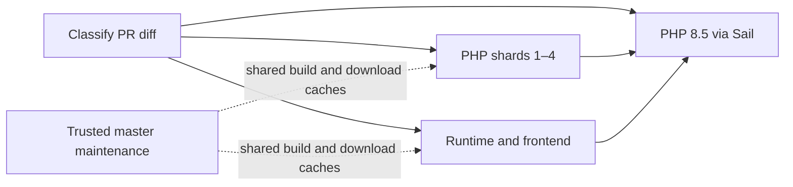

# GitHub Actions CI Optimization Plan

Status: ready for implementation
Date: 2026-09-07
Issue: [#495](https://github.com/KurzonDax/newznab-tmux-kd/issues/495)
Repository baseline: `cd4334a936b1ed8a24cf2d89052464652a8fa895`

## Problem and decision

Full CI takes about eleven minutes, principally because every run rebuilds the
development container and executes the PHP suite sequentially. Strict branch
protection then requires another run whenever master advances. A successful merge
also starts another full pipeline on master, frequently testing identical files.

Keep GitHub Actions and the current personally owned public repository. Use a
shared Docker build cache, four independent PHP shards, and one runtime/frontend
job. Preserve the required check name `PHP 8.5 via Sail`, strict up-to-date branch
protection, and all tests selected by the current main PHPUnit configuration.
Replace full post-merge repetition with targeted cache maintenance and a daily
serial regression run. Cancel obsolete runs of the same pull request.

This document settles the implementation design. It does not require a new
instrumentation system, timing-data collection project, comparative provider
trial, or preliminary benchmark phase. Existing Actions history supplies the
baseline. Implementation still requires ordinary correctness checks and a
successful real Actions run; documented platform support cannot establish the
future pipeline's actual elapsed time.

## Existing evidence

The audit examined the workflow, Compose/Docker runtime, Make targets, test
harnesses, merge helper, required-check ruleset, and 482 workflow-run records from
August 11 through September 7. Durations below come from completed runs and job
step timestamps, not local-machine extrapolation.

| Observation | Baseline and implication |
| --- | --- |
| Recent full runs | 31 runs on September 5–7: median 659 seconds (10:59), range 604–836 seconds. This is the performance comparison cohort; do not mix in fast documentation runs. |
| Main PHP step | Median 442 seconds, range 383–581. This is the largest opportunity for parallel execution. |
| Sail startup/build | Median 139 seconds, range 118–259. Together with PHP execution, approximately 88% of the measured critical path. |
| Other steps | Composer about 14 seconds; focused isolation about 23; frontend about 20; shell regressions about 2; production permission checks about 5. Optimizing these alone cannot solve the delay. |
| Queue time | Typically 3–4 seconds in the recent full-run sample. Existing evidence points to execution time rather than runner allocation as the current bottleneck. |
| Repeated work | Recent 99 completed runs included 62 PR runs across 38 branches and 37 master pushes. Master runs consumed approximately 6 hours 14 minutes of workflow elapsed time. This is not a billing calculation. |
| Base-update amplification | PR #430 ran six times, approximately 57.5 workflow minutes; #426 ran five times, approximately 46.9 workflow minutes. Strict base updates remain necessary under the chosen protection policy. |
| Setup reliability | Of 14 failures in the larger sample, six were setup failures: three Docker/package-repository failures and three Composer ownership/writability failures. Caching reduces exposure to package servers; explicit startup readiness addresses the observed ownership failure mode. |

A concrete reference is [run 34126265931](https://github.com/KurzonDax/newznab-tmux-kd/actions/runs/34126265931):
11:16 elapsed, 125 seconds starting Sail, 15 seconds installing Composer
dependencies, and 443 seconds in the main test step. PHPUnit reported 3,848 passed,
35 skipped, and 16,006 assertions. Separate steps ran 41 ingestion/cleanup MariaDB
tests, five backup MariaDB tests, 82 repeated settings tests for cache isolation,
and 57 JavaScript tests. Assertion/test counts naturally change with source
changes; they are reference counts, not constants to hardcode into CI.

The tested merge commit for [PR #492](https://github.com/KurzonDax/newznab-tmux-kd/pull/492)
and its resulting squash commit have the same Git tree
`61d4114abb8c6b6bdcd78d9e48cd788de06ccce0`, demonstrating an actual duplicate
content run. This does not assert that commit-dependent behavior or upstream
package availability is identical; the daily job retains independent detection.
[Run 33190950987](https://github.com/KurzonDax/newznab-tmux-kd/actions/runs/33190950987)
demonstrates the existing documentation-only fast path at approximately eight
seconds. Preserve that behavior, allowing for the extra aggregate-job scheduling.

## Scope decisions

| Refinement | Decision |
| --- | --- |
| Rebuilding the same Docker layers | Restore a shared BuildKit Actions cache in each execution job; trusted master maintenance writes it. |
| Sequential main suite | Four file-level shards on separate hosted runners; existing PHPUnit, no ParaTest dependency. |
| Frontend and integration work behind the main suite | Run together in a fifth execution job beside the shards. |
| Entire settings suites repeated for cache isolation | Keep their full main-suite execution; repeat only three representative methods inside the cache snapshot harness. |
| Full suite on every master push | Remove after the replacement PR gate is established; daily serial validation remains. |
| Superseded PR commits | Cancel the earlier run for that PR; update merge monitoring before enabling cancellation. |
| npm resolution on every build | Add a CI-specific build target using `npm ci --no-audit --no-fund`; retain build permission normalization. |
| Dependency downloads | Cache Composer package downloads and npm content cache; always perform lockfile installs. |
| Unused coverage instrumentation | Disable Xdebug modes and PCOV in the CI container's CLI PHP configuration. |
| Dependency advisory checks | Retain informational audits on dependency-changing PRs and every daily run. |
| Documentation-only changes | Preserve the existing allowlist and explicit successful required check. |
| Per-feature/path-selected regression suites | Excluded: every non-documentation PR runs all four main-suite shards and the runtime job. |
| Platform/ownership change | Excluded: no transfer, merge queue, paid runner, self-hosted runner, GHCR package, or CI migration. |

## Workflow topology and merge contract

Keep `.github/workflows/laravel.yml` named `Run tests`, triggered on
`pull_request` without a workflow-level `paths` filter. Default checkout must
remain GitHub's PR merge ref, so tests exercise the proposed change against its
base. Do not switch checkout to the unmerged PR head.



The dashed cache relationships are not job dependencies. Every job can build and
install from scratch. There is no image-preparation job that serializes the PR
critical path, and no image artifact uploaded and downloaded between jobs.

Use fixed job IDs `scope`, `php`, `runtime`, and `required`. The `php` matrix has
`shard: [0, 1, 2, 3]`, `fail-fast: false`, and `max-parallel: 4`. Neither test job
uses `continue-on-error`. Use `ubuntu-24.04` consistently, with a 20-minute timeout
per execution job and five minutes for the small classifier/aggregate jobs.

The `required` job alone has display name **`PHP 8.5 via Sail`**. It declares
`needs: [scope, php, runtime]` and `if: ${{ always() }}`. It reads dependency
results and exits nonzero for every state outside this table:

| Classification | `scope.result` | `php.result` | `runtime.result` | Required result |
| --- | --- | --- | --- | --- |
| `code=true` | success | success (all matrix jobs) | success | success |
| `code=false` | success | skipped | skipped | success |
| Missing/invalid output, unexpected skip, failure, or cancellation | any other combination | any | any | failure |

Do not use matrix outputs to count passing shards: shared matrix output names
can overwrite each other. The fixed matrix's overall result and explicit
dependencies supply the gate. The aggregate must execute an actual assertion,
not merely print results. A workflow cancellation can itself cancel the
aggregate; that is not success and cannot satisfy the required check.

GitHub documents both dependency handling with `always()` and the pitfalls of
skipped required workflows/jobs. This arrangement keeps an explicit decision on
every PR while leaving the current ruleset context unchanged.
([Job dependencies](https://docs.github.com/en/actions/how-tos/write-workflows/choose-what-workflows-do/use-jobs),
[required-check behavior](https://docs.github.com/en/pull-requests/how-tos/merge-and-close-pull-requests/troubleshooting-required-status-checks))

### Change classification

Extract the current classifier into a small testable shell helper. On the PR
merge checkout, compare its first parent with HEAD. Fetch depth two suffices for
that comparison. Use NUL-delimited names and `--no-renames`, so both sides of a
rename participate and unusual names do not split into misleading records.

Only a nonempty diff consisting entirely of `docs/**`, `.ai/**`, `*.md`, or the
root `LICENSE` qualifies for the fast path. A missing parent, empty diff, diff
failure, unknown classification, or any other path requires full CI. Errors
must either yield `code=true` or fail classification; they must never look like
documentation. Workflow, Docker, shell, lockfile, and test changes run everything.

Also output `dependencies=true` when `composer.json`, `composer.lock`,
`package.json`, or `package-lock.json` changes. An uncertain diff sets this true.
This output affects only the informational audit, never test selection.

### Cancellation and merge monitoring

For the PR-only workflow use:

```yaml
concurrency:
  group: ${{ github.workflow }}-${{ github.ref }}
  cancel-in-progress: true
```

The PR merge ref distinguishes different PRs; the workflow name distinguishes
other workflows. A replacement commit or base merge cancels only that PR's old
run. Do not use a repository-global PR group. GitHub supports this directly.
([Concurrency](https://docs.github.com/en/actions/how-tos/write-workflows/choose-when-workflows-run/control-workflow-concurrency))

During phase 2, while the same workflow still handles master pushes, use group
`${{ github.workflow }}-${{ github.event_name }}-${{ github.ref }}` and
`cancel-in-progress: ${{ github.event_name == 'pull_request' }}`. Switch to the
PR-only form above when phase 3 removes the push trigger.

Update `scripts/agent-issue-finish` before enabling this policy. It currently
classifies *all* status-rollup entries as required and treats cancellation as a
terminal failure. Read actual required checks through
`gh pr checks --required --json name,state,bucket,link,workflow`, retaining the
separate PR state, review, conflict, and strict-base checks. Require the expected
aggregate context to be present; absence is pending, never an empty success.
Inspect JSON states explicitly: command exit status alone is insufficient,
particularly for skipped/cancelled checks and JSON output.
([GitHub CLI checks](https://cli.github.com/manual/gh_pr_checks))

Read the PR head OID before and after each checks snapshot. Discard a snapshot if
the head changes; likewise re-read after a base-update push. Old-head cancellation
is superseded work, whereas cancellation of the current required run without a
replacement remains actionable. For a rerun on the same head, follow the newest
attempt identified by the check's Actions URL/API rather than treating an older
attempt's cancellation as the latest result. Pending replacement checks remain
pending. API errors remain distinguishable from check failures.

The helper continues to arm squash auto-merge and wait for GitHub's `MERGED`
state before cleanup. It must not force a merge based on its own observations,
ignore an actual current-head failure, bypass reviews, or relax strictness.
Faster runs shorten the base-update cycle; this scope does not eliminate it.

## Shared Sail setup and caching

Create a repository composite action at `.github/actions/ci-sail/action.yml` to
share setup between the PHP matrix, runtime job, and maintenance. Checkout stays
an explicit preceding workflow step. Use current supported official actions,
resolved to reviewed full commit SHAs during implementation; do not add an
unmaintained cache or changed-files action.

### BuildKit recipe

Set host identity from `id -u`/`id -g`, copy `.env.test` to `.env`, and create the
job-local cache mount directories before starting Sail. Configure Buildx with
`docker/setup-buildx-action`, then use `docker/build-push-action` with:

```yaml
context: ./docker/8.5
file: ./docker/8.5/Dockerfile
platforms: linux/amd64
build-args: |
  WWWGROUP=${{ env.WWWGROUP }}
tags: nntmux-ci/php85
load: true
push: false
cache-from: type=gha,version=2,scope=php85-linux-amd64-v1
```

PR jobs omit `cache-to`. Trusted maintenance adds
`cache-to: type=gha,version=2,scope=php85-linux-amd64-v1,mode=max,ignore-error=true,timeout=2m`.
BuildKit accounts for Dockerfile/context/build-argument changes when reusing
layers; a stable scope is not permission to reuse incompatible layers. Bump its
`v1` suffix only for an intentional cache reset or recipe migration. No QEMU or
multi-platform build is needed.

The explicit local context is essential: the build action's default Git context
would ignore preceding workspace preparation. `load: true` puts the image in
this runner's Docker engine. Buildx's container driver supports the Actions cache;
the default Docker driver is not the assumed cache backend. Cache API v2 requires
Buildx at least 0.21 and BuildKit at least 0.20, available through the supported
official actions. A cache hit still requires restore and local image loading;
it is not a zero-cost prebuilt-image pull.
([Build action](https://github.com/docker/build-push-action),
[Actions cache backend](https://docs.docker.com/build/cache/backends/gha/),
[Docker cache tooling requirements](https://docs.docker.com/build/ci/github-actions/cache/))

Add a CI-only Compose override, `.github/docker-compose.ci-optimized.yml`, selected
alongside `.github/docker-compose.ci.yml` by these workflows. Set the app service's
`pull_policy: never` and keep its image exactly `nntmux-ci/php85`; start it with
`./sail up -d --no-build laravel.test`. Do not apply `--pull never` globally:
MariaDB still needs a normal image pull on a fresh runner. The base Compose file
remains usable by issue-worktree startup, which still builds its own runtime.
([Compose build/image behavior](https://docs.docker.com/reference/compose-file/build/),
[service pull policy](https://docs.docker.com/reference/compose-file/services/#pull_policy))

Missing or evicted cache entries trigger an ordinary build. If cache import
itself fails, make one explicit retry without `cache-from`; a real build failure
still fails the job. Cache export failure warns but cannot convert failing tests
to success. Do not cache a built workspace, `.env`, credentials, generated Laravel
caches, `vendor`, or `node_modules`.

Default/base-branch caches are available to PRs, including fork PRs; PR cache
writes would be isolated to the merge ref and cannot warm sibling PRs or master.
Use restore-only PR jobs and a single trusted writer. Keep the default 10 GB
storage budget; entries can be evicted after seven days without access. Cache
capacity is an optimization constraint, not an availability requirement.
([GitHub cache access and limits](https://docs.github.com/en/actions/reference/workflows-and-actions/dependency-caching))

### Identity, dependencies, and PHP runtime

After `up -d`, wait up to 60 seconds for the entrypoint to finish remapping the
`sail` UID to `WWWUSER`, then verify as `sail` that the checkout and required
runtime directories are writable. Check UID and permissions without creating
persistent source files. Fail with container logs if readiness never arrives.
Container creation alone is not proof that identity initialization has completed.
The historical Composer failures support fixing readiness, but do not establish
that this race explains every historical permissions incident.

Install Composer dependencies as `sail` with the existing `umask 0022`, lockfile,
development dependencies, and normal package scripts. Add noninteractive and
prefer-dist flags without suppressing Laravel package discovery. Generate the
app key as today. Never share installed dependencies between parallel jobs.

Bind `${RUNNER_TEMP}/nntmux-ci-cache/composer` and
`${RUNNER_TEMP}/nntmux-ci-cache/npm` into the container at `/ci-cache/composer`
and `/ci-cache/npm` through the override. Set container `COMPOSER_CACHE_DIR` and
`npm_config_cache` accordingly; prepare ownership for the runner-mapped `sail`
user. Host Actions cache paths must refer to these host directories, not a
container-only home directory. Cache only Composer's `files` subtree and npm's
`_cacache` subtree, excluding configuration, auth, and logs.

Use separate download-cache keys: OS/architecture + PHP 8.5 + `composer.lock`
hash for Composer; OS/architecture + Node 22 + `package-lock.json` hash for npm,
with a schema prefix for both. A compatible prefix restore is allowed because
lockfile installation still runs. PR jobs use `actions/cache/restore`; successful
master maintenance uses `actions/cache/save` only when the exact key is absent.
PHP shards need only the Composer cache; the runtime job needs both.

Add `make npm-build-ci` rather than changing the developer-oriented `npm-build`
target. It uses `npm ci --no-audit --no-fund`, then the existing Vite build and
`normalize-build` permission handling. Preserve lifecycle scripts and dev
dependencies. Lockfile mismatch must fail, not silently rewrite the lockfile.
Run `npm run test:js` afterward.
([npm clean installs](https://docs.npmjs.com/cli/v10/commands/npm-ci/))

Mount a committed `.github/php-ci.ini` at
`/etc/php/8.5/cli/conf.d/zz-nntmux-ci.ini`, after the extension configuration,
with `xdebug.mode=off` and `pcov.enabled=0`. Assert the
effective CLI values when the extensions are present. Setting a host environment
variable without forwarding it into Compose is insufficient. Keep normal
developer debug settings and the Dockerfile's extension/media-tool inventory.
The current pipeline produces no coverage report, so disabling collection does
not remove an existing deliverable. No speedup percentage is assigned to this
change without evidence.
([Xdebug mode](https://xdebug.org/docs/all_settings#mode),
[PCOV configuration](https://github.com/krakjoe/pcov#configuration))

Workflow-only mount/cache variables belong to the CI setup. Any new environment
key consumed by repository code or Compose must also be documented with an
appropriate example/default in `.env.example`, per repository policy.

## Test execution contract

### Four complete PHP shards

Add `scripts/ci-phpunit-shard`, invoked inside Sail after dependency installation.
The host entry point is `./sail exec -T -u sail laravel.test
scripts/run-tests-isolated.sh scripts/ci-phpunit-shard --index N --count 4`.
The shard helper runs discovery and then `php artisan test --compact` inside
that existing isolation wrapper, forwarding `--cache-directory` from
`PHPUNIT_CACHE_DIRECTORY`. Do not invoke another Docker/Sail command from inside
the container or bypass `scripts/run-tests-isolated.sh` for the sharded suite.
Use the installed PHPUnit's `--list-test-files` output as the source of truth for
the selected files, with the existing `phpunit.xml`. The installed version is
12.5.33; its CLI was inspected while preparing this proposal and supports this
option and multiple positional test files.

Normalize discovered paths relative to `/var/www/html`, sort bytewise, and assign
file index modulo four to shard 0–3. Parse the documented file-list lines
explicitly, reject discovery errors, duplicates, unexpected paths/output, invalid
shard arguments, and empty partitions. Execute the selected files in one PHPUnit
invocation through the existing Artisan test wrapper, using a properly quoted
argument array and `--fail-on-empty-test-suite`. Preserve the original XML
bootstrap, environment, and result policy; do not build a second reduced PHPUnit
configuration. Output the shard's file count for ordinary diagnosis.

This automatically follows configured suite membership as files are added. The
implementation contract tests must prove that all four partitions form exactly
the discovered set, with no overlaps or omissions, including filenames that
require quoting. Verify normal test discovery and explicit-file execution select
the same cases once when implementing; no historical timing artifact is needed.
([PHPUnit 12.5 CLI](https://docs.phpunit.de/en/12.5/textui.html))

All currently selected Install, Unit, and Feature files remain included, including
existing skipped/API-dependent cases. Do not add `--fail-on-skipped` to this suite:
it currently has intentional skips. Do not silently drop slow tests or move them
to nightly-only execution. Keep each file intact so data providers and intra-class
`Depends` relationships remain together. The inspected dependency attribute is
in `TestCaseHardeningTest` and is intra-class.

Each job has its own runner, checkout, Docker engine, temporary files, and app
container. The main suite uses SQLite and needs no MariaDB startup. File-level
isolation avoids ParaTest process coordination and shared SQLite state. Existing
environment-restoration guards remain active within each shard. Cross-file order
changes and some cross-shard state-leak detection is lost on the PR path; the
daily unsharded run preserves that additional diagnostic coverage. This is an
explicit tradeoff, not a claim that parallel and serial execution are identical.

### Runtime and frontend job

Use the same setup and execute these stages serially within the fifth job:

1. Start MariaDB with the existing `./sail up -d --wait mariadb` health check.
2. Run `CbpMariaDbIngestionTest.php` and `ReleaseCleanupSafetyMariaDbTest.php`
   using the existing `CBP_INTEGRATION_DB_*` values and `cbp_integration` database.
3. Run `BackupSchemaMariaDbTest.php` with `BACKUP_INTEGRATION_MARIADB=1` and the
   existing `--fail-on-skipped` guard.
4. Run `make test-permissions`, retaining all three current shell regressions.
5. Run the narrowed cache-isolation harness described below.
6. Run `make npm-build-ci` and `./sail npm run test:js`.
7. Run `make fix-permissions` followed by `make check-permissions`.
8. On dependency changes, run `make deps-audit` as an informational step with
   `continue-on-error: true`; retain its visible warning/output.

Do not parallelize the three MariaDB classes within this job: they exercise
shared schemas, including destructive fixture setup. The cleanup test's inherited
SQLite-equivalent cases deliberately validate MariaDB behavior and are not
redundant coverage to remove. Do not run permission normalization concurrently
with build, Composer, tests, or cache snapshots in the same checkout.

All execution jobs tear down Sail using an `always()` cleanup step; cleanup
failure must not be mistaken for passing validation. Hosted-runner disposal
provides the final isolation boundary if cancellation interrupts cleanup.

### Narrow the repeated cache-isolation pass

Keep `tests/Shell/FocusedSailIsolationTest.sh` and its before/after snapshots of
live `storage/framework/views` and `bootstrap/cache`, including bytes and
metadata. Add an explicit CI mode selecting these existing methods:

- `SettingsWorkerBoundsTest::test_every_worker_field_still_lives_on_the_page_that_owns_its_pane`
- `SettingsHubPagesTest::test_the_website_page_renders_its_cards_from_the_registry`
- `SettingsHubPagesTest::test_a_picker_card_saves_and_rejects_an_out_of_range_number`

Use the two explicit files plus an anchored method filter, and fail if the
expected selection disappears. These cover rendering across worker sections,
shared layout rendering, valid saves, and rejected saves. Every other settings
assertion still runs once in the main shards. This reduces the *second* pass's
breadth intentionally; it retains representative cache-isolation proof rather
than claiming to snapshot every settings case.

`make test-focused-cache-isolation` selects this CI mode and keeps
`PERMISSION_TEST_SKIP_HTTP=1`. Preserve the existing full focused-test mode and
authenticated HTTP verification for deployment use via
`make test-focused-isolation`. No new credentials or live-site request is added
to Actions.

## Master maintenance and daily serial validation

Create `.github/workflows/ci-maintenance.yml` with distinct job/check names; it
must never emit the PR gate name. Use `permissions: contents: read`, as for PR
validation. There is no package registry publication, OIDC setup, or PAT.

Its push trigger targets master and includes only these input paths:
`docker/8.5/**`, `.github/docker-compose.ci*.yml`, `.github/php-ci.ini`,
`.github/actions/ci-sail/**`, `.github/workflows/ci-maintenance.yml`,
`.github/workflows/laravel.yml`, `composer.json`, `composer.lock`, `package.json`,
`package-lock.json`, `sail`, `Makefile`, `.env.test`, and `scripts/ci-*`.
This optional workflow may safely use path filters because it is not required
for merging. GitHub evaluates the push's changed-file range; do not substitute
`HEAD^..HEAD`, which misses earlier commits in a multi-commit push.

On such a push, restore/build/load/export the runtime and warm Composer/npm
download caches through real installs. Perform readiness, PHP version/extension
configuration checks, and `artisan --version` startup smoke. Do not rerun the
full regression suite. Application-only and documentation merges need no
additional maintenance run because their runtime/dependency inputs are unchanged.

Add a daily `schedule` at `17 8 * * *` (08:17 UTC) and `workflow_dispatch` for an
on-demand full validation. For both, require `github.ref == 'refs/heads/master'`.
In one job, build with `pull: true` and `no-cache: true`, install dependencies,
then run the full original unsharded PHP command followed by the same runtime
and frontend stages above, with dependency audits always enabled. Use a
30-minute job timeout. The tests consume the exact freshly loaded image in that
job, not an independently restored image in a concurrent downstream job.

The fresh build deliberately refreshes apt/package layers; `pull: true` alone
does not invalidate a cached `RUN apt ...` layer when the base image is unchanged.
BuildKit exports during the build, before tests. Therefore cache publication is
not a certification of a passing runtime: a later test failure can leave a
usable cache entry, and every PR still validates its own build. Report the daily
failure through normal Actions status/notifications; do not call a cache hit a
previously tested immutable image.
([Docker invalidation](https://docs.docker.com/build/cache/invalidation/))

Serialize all maintenance executions with one shared concurrency group,
`ci-cache-maintenance-master`, and `cancel-in-progress: false`. This prevents
simultaneous writers; it is not a durable FIFO queue, and pending runs can be
replaced. A delayed/missed nightly execution can be dispatched manually. Scheduled
Actions are supplemental and can be delayed or dropped, so they cannot replace
the PR's complete regression gate.
([Scheduled events](https://docs.github.com/en/actions/reference/workflows-and-actions/events-that-trigger-workflows#schedule))

## Capacity, expected benefit, and boundaries

Standard Linux runners for a public repository provide four CPUs and 16 GB RAM;
this plan already uses that class. Pinning `ubuntu-24.04` avoids an unexpected OS
label migration, not hosted-image updates. No switch to `ubuntu-slim`, ARM, or
larger runners is proposed.
([Hosted runners](https://docs.github.com/en/actions/reference/runners/github-hosted-runners))

With perfectly balanced shards, the historical 442-second main step contributes
about 111 seconds per shard before setup and scheduling. Real file costs are
unequal; four file partitions do not promise a fourfold speedup. A warm PR
elapsed time around three to five minutes is a planning expectation, not a
measured result or a prerequisite for finalizing this design. Cold Docker builds
and slow individual test files can push it higher. The immediate measurable
structural gains are parallel execution, cached setup, cancellation of obsolete
work, and removal of full post-merge duplication.

Five concurrent execution jobs per PR increase total runner-minutes even while
reducing elapsed time, especially on a cold cache. GitHub Free permits 20
concurrent standard jobs account-wide and Pro 40; the account's actual plan was
not needed to choose this design. Four simultaneous full PRs can exhaust the
Free allowance before maintenance/other repositories. The historical 3–4-second
queue does not guarantee future queue time under increased fan-out. Start with
four shards, not an unbounded matrix.
([Actions limits](https://docs.github.com/en/actions/reference/limits))

Do not weaken strict branch protection to avoid base-update runs. A merge queue
would address that orchestration differently, but GitHub's public-repository
merge queue availability requires organization ownership. Moving this personal
repository is outside scope.
([Merge queue availability](https://docs.github.com/en/repositories/configuring-branches-and-merges-in-your-repository/configuring-pull-request-merges/managing-a-merge-queue))

Other deliberate exclusions:

- **GHCR prebuilt images and inter-job image archives:** both are technically
  supported, but add registry bootstrap or transfer/dependency overhead. Newly
  published GHCR packages start private, even for public repositories; anonymous
  pulls require a separate visibility change. BuildKit caching avoids that
  prerequisite. ([Package visibility](https://docs.github.com/en/packages/learn-github-packages/configuring-a-packages-access-control-and-visibility),
  [image sharing](https://docs.docker.com/build/ci/github-actions/share-image-jobs/))
- **Dockerfile slimming, native-host PHP, ParaTest, and Laravel application/config
  caching:** defer runtime changes that would require a separate compatibility
  exercise. Current tests exercise native media tools and bootstrap/isolation
  behavior. Do not remove extensions or cache app state simply to save seconds.
- **Live API test cleanup:** the audit found real external-client paths among
  Feature tests, including TVMaze; the documentation's blanket HTTP-mocking claim
  is inaccurate. Preserve current coverage in this change. Converting those tests
  to fixtures or explicit opt-in integration tests needs its own behavioral scope;
  do not silently exclude every `*ApiTest` class.
- **Additional integration suites:** four other MariaDB suites and three live
  API suites under `tests/Integration` are not currently selected by this workflow.
  Preserve the current three-file MariaDB gate; expanding it is a separate
  coverage decision, not a speed optimization.
- **New Pint, PHPStan, TypeScript, coverage, or design-system PR gates:** these
  are not current Actions stages. Required local repository checks remain in
  force; this proposal neither deletes them nor adds unrelated CI workloads.
- **Instrumentation platform, timing artifacts, adaptive sharding, extensive
  benchmark matrix, and CI-provider evaluation:** unnecessary to select and
  implement the chosen design.

## Implementation sequence and acceptance

Implement as three ordinary issue/PR changes in this order. Each remains subject
to the existing merge workflow and applicable repository checks.

1. **Setup reuse and maintenance.** Add shared setup, the CI-only Compose/PHP
   overrides, download caches, `npm-build-ci`, and the maintenance workflow.
   Initially keep the serial PR/master validation intact. Merge and let trusted
   master maintenance populate caches; a cold cache remains valid throughout.
2. **Parallel required gate and monitoring.** Add classification/partition helpers,
   four shards, the runtime job, aggregate truth table, narrowed isolation mode,
   and required-check-aware merge monitoring. Enable PR cancellation only with
   that monitoring change. Retain the old full master path temporarily under a
   distinct check name. The PR must pass the new complete aggregate gate.
3. **Remove full push repetition.** Make `Run tests` PR-only after the replacement
   gate has passed normally and maintenance/daily validation exist. Update the
   development workflow documentation to describe the final graph, cancellation,
   maintenance, and manual full-run command. No ruleset weakening or context
   rename is needed in any phase.

The short transition is release sequencing, not a preliminary benchmark project.
Do not retain permanently duplicated old and new PR suites.

Required correctness acceptance for implementation:

- Exercise classifier fixtures for documentation-only, mixed, workflow, deleted,
  renamed, whitespace-containing, empty, and failed-diff cases. Test dependency
  classification independently from the required gate.
- Exercise partition set equality/disjointness, new-file discovery, invalid/empty
  shard handling, and quoted arguments. Confirm the installed PHPUnit selection
  equals the union of shard selections; keep intentional skips visible.
- Test the aggregate truth table, including classification failure, a failed
  shard, unexpected skip, and cancellation. The context must be emitted on a
  docs-only PR and must fail when required execution fails.
- Use mocked GitHub responses to exercise the monitor's actual required checks,
  missing checks, JSON error handling, head changes during reads, old cancellation,
  same-head reruns, current failure/cancellation, reviews, base updates, and merged
  cleanup. Do not force real failing PRs merely to exercise these branches.
- Validate Actions YAML/expressions with a supported workflow linter and Compose
  configuration expansion. In normal CI, confirm a clean install, matching local
  image consumption, UID readiness, effective PHP settings, all MariaDB guards,
  frontend tests/build, and permission/isolation checks. Verify missing caches
  are not configured as failures; the first cold run supplies real build coverage.
- Confirm the daily/manual job runs serial tests on its own freshly built image,
  PR cache writes are absent, and no optional maintenance job has the required
  context name. No untrusted `pull_request_target` code execution is introduced.

Use existing Actions job/step timestamps for post-implementation comparison with
the 659-second full-run median. Aim for a warm median at or below five minutes;
assess cold runs and account queueing separately. Review ordinary subsequent runs
for shard imbalance and unexpected skips/failures; do not block the design on
collecting a predetermined new sample or building reporting infrastructure.

If the aggregate or partition contract is wrong, restore the serial required job
through the normal PR process immediately. If cache infrastructure misbehaves,
disable cache restore/export and retain ordinary builds. If matrix queueing or
imbalance defeats the expected benefit, reduce the fixed shard count or adjust
partitioning in a follow-up supported by the normal run logs. Retain the required
context and strict merge policy through rollback.

## Files expected to change during implementation

| Path | Responsibility |
| --- | --- |
| `.github/workflows/laravel.yml` | PR classifier, matrix, runtime job, aggregate, concurrency, eventual push removal. |
| `.github/workflows/ci-maintenance.yml` (new) | Trusted cache warming, daily/manual serial validation. |
| `.github/actions/ci-sail/action.yml` (new) | Shared Docker/cache/identity/Composer setup. |
| `.github/docker-compose.ci-optimized.yml` (new) | CI-only local image pull policy, package cache mounts, PHP ini mount. |
| `.github/php-ci.ini` (new) | Disable unused CLI instrumentation in CI. |
| `scripts/ci-classify-changes`, `scripts/ci-phpunit-shard`, `scripts/ci-required-result` (new) | Testable classification, complete partitioning, aggregate assertion. |
| `scripts/agent-issue-finish` | Actual required-check monitoring and superseded-run handling. |
| `Makefile` | CI npm target and explicit focused-isolation CI mode. |
| `tests/Shell/FocusedSailIsolationTest.sh` | Narrow CI repetition while retaining deployment mode. |
| Focused tests under `tests/Shell/` and/or `tests/Unit/` | Behavioral contracts for the new orchestration helpers. |
| `.env.example` | Document any introduced Compose/environment keys. |
| `docs/agents/development-workflow.md` | Document final contributor-visible CI and monitor behavior. |

The Dockerfile, application code, dependency versions, repository ownership,
ruleset, and external service configuration need no planned change. This proposal
commit changes documentation only; it does not activate any of the implementation
above.
